# Nexora - Universal PC Remote Control

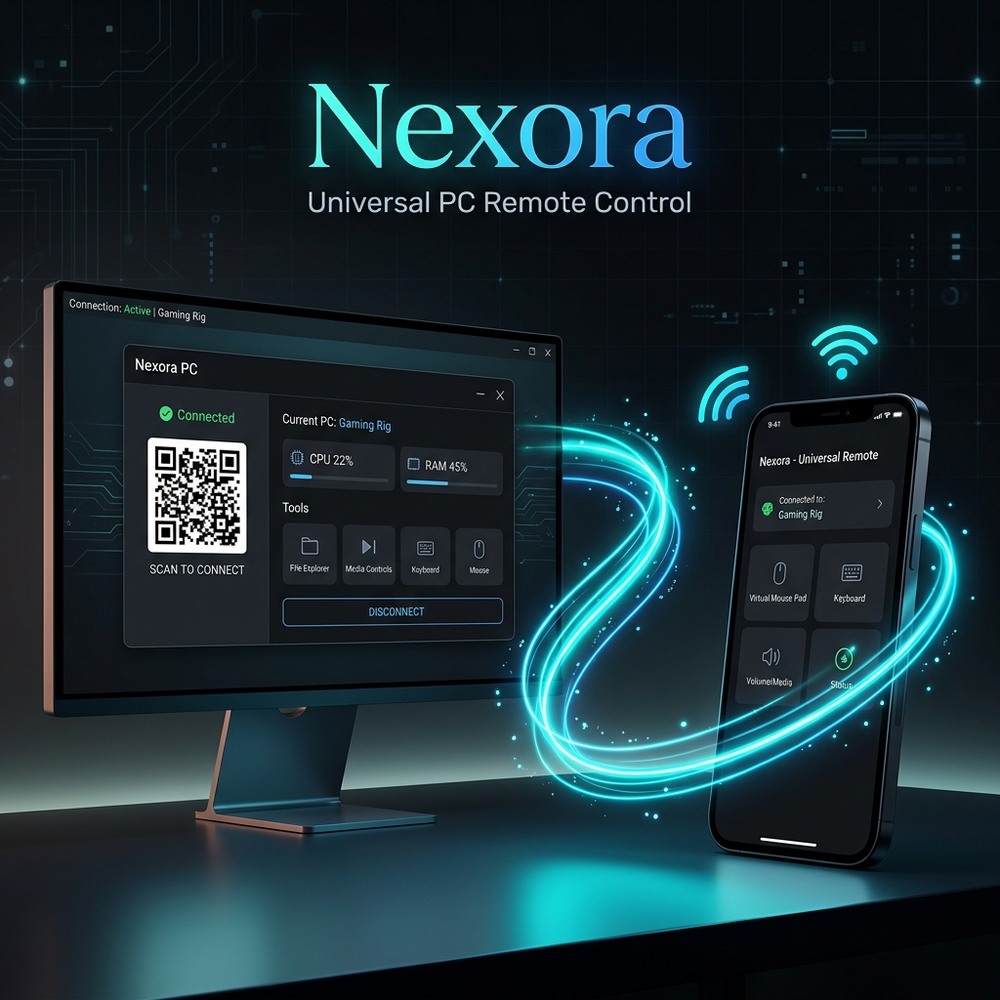

Transform your mobile device into a powerful remote control for your Windows PC! Nexora provides a secure, fast, and local connection to control your mouse, type on your keyboard, sync your clipboard, and transfer files seamlessly.

Nexora is designed and officially maintained by [Launch Your Concept](https://www.launchyourconcept.com/).

---

## 🚀 Download Nexora

Choose your platform to get the latest stable version of Nexora.

| 💻 Nexora Desktop (Windows) | 📱 Nexora Mobile (Android) |
| :---: | :---: |
| [-0284c7?style=for-the-badge&logo=windows&logoColor=white)](https://github.com/baaghinitesh/Nexora-desktop-release/releases/latest/download/Nexora-Setup.exe) | [-10b981?style=for-the-badge&logo=android&logoColor=white)](https://github.com/baaghinitesh/updated-mouse-app/releases/latest/download/Nexora-Mobile.apk) |
| **File:** `Nexora-Setup.exe` | **File:** `Nexora-Mobile.apk` |
| *Windows 10 & 11 (64-bit)* | *Android 8.0 or higher* |

### Quick Installation Guide:

#### For Desktop (Windows):
1. Click the **Download Desktop App** badge above to get the `Nexora-Setup.exe` file.
2. Open the downloaded installer and follow the setup wizard.
3. The installer will automatically configure the Windows Firewall rules for you.
4. Launch Nexora from your Desktop or Start Menu!

#### For Mobile (Android):
1. Click the **Download Mobile App** badge above to download the `Nexora-Mobile.apk` file on your Android device.
2. Open the downloaded `.apk` file (you may need to allow "Install from Unknown Sources" in your browser/file manager settings).
3. Follow the Android package installer prompts to install the app.
4. Launch Nexora Mobile and scan the QR code on your PC screen to connect!

---

## ✨ Features

- 🖱️ **Advanced Touchpad Control** — Supports native gestures (double-tap for double-click, tap-and-drag for text selection, two-finger pan for scrolling, two-finger tap for right-click).
- ⌨️ **Real-Time Keyboard Input** — Persistent background process for ultra-low keypress latency.
- 📋 **Bidirectional Clipboard Sync** — Copy text on your PC and paste it on your phone, or vice versa, instantaneously.
- 📁 **High-Speed File Transfer** — Send photos, videos, and files directly between your phone and your PC's Downloads folder.
- 🔄 **Seamless Auto-Updates** — Checks, downloads, and notifies you when new releases are published to GitHub.
- 🔍 **mDNS Auto-Discovery** — Discovers your PC automatically on the local network.
- 📱 **QR Code Quick Connect** — Scan to connect in seconds.
- 🔒 **Secure Local Connection** — Works entirely over your local network (Wi-Fi or Hotspot); no data ever leaves your devices.

---

## 📱 Connecting Your Mobile Device

### Method 1: Wi-Fi (Recommended)
1. Ensure both your PC and your phone are connected to the same local Wi-Fi network.
2. Open Nexora Desktop on your PC. It will display a local IP Address (e.g. `192.168.1.50`) or a QR code.
3. Open the Nexora Mobile App, scan the QR code, or enter the IP Address.
4. Click **Connect** and start remote controlling!

### Method 2: Mobile Hotspot
1. Turn on Mobile Hotspot on your Windows PC (Settings → Network → Mobile hotspot).
2. Connect your phone to the newly created PC Hotspot.
3. Open Nexora Desktop on your PC. It will show the hotspot IP (usually `192.168.137.1`).
4. Enter this IP address in the Nexora Mobile App and click **Connect**.

*Note: If you run into connection issues, click the **Auto Setup** button in the Settings tab of Nexora Desktop.*

---

## 🔄 Seamless Auto-Updates

You don't need to manually check this repository for updates! Nexora Desktop features a built-in background updater:
1. **Checking**: The desktop app checks this repository in the background on startup.
2. **Downloading**: If a new release is available, the updater downloads it quietly.
3. **Applying**: Once the download completes, a prompt will appear asking if you want to restart and apply the update. You can also view the update progress in the **Settings** tab.

---

## 🆘 Support, Feedback & Contact

For support, feedback, bug reporting, or custom requests:

- 🌐 **Official Website**: [launchyourconcept.com](https://www.launchyourconcept.com/)
- ✉️ **Contact & Support Form**: [launchyourconcept.com/contact](https://www.launchyourconcept.com/contact)

---

## 📸 Application Showcase & User Guide

### Desktop Dashboard & Control Panel
The Nexora Desktop application provides real-time connection telemetry, local IP details, and a system tray manager:

| Dashboard View | File Transfers Queue | Active Settings |
| :---: | :---: | :---: |
| 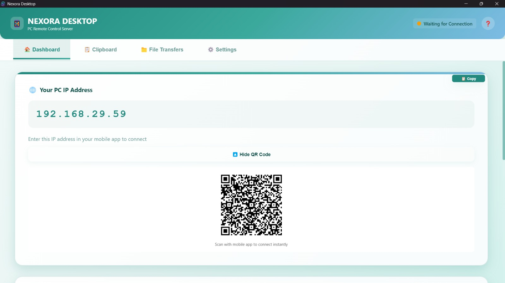 | 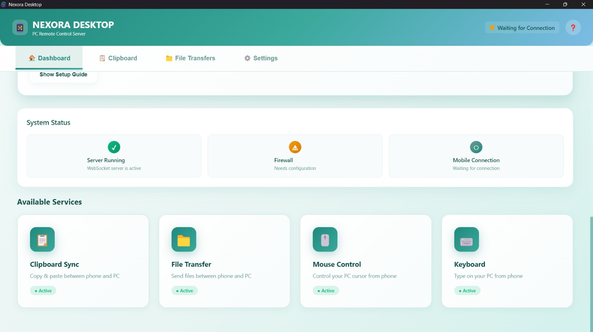 | 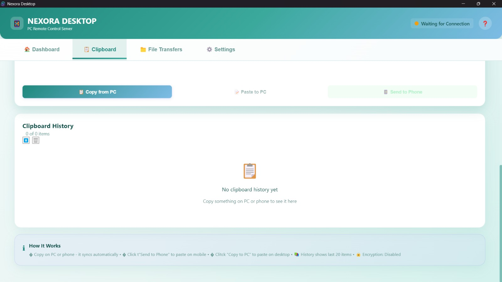 |

### Mobile Remote Control Interfaces
Control your cursor, click, scroll, draw, type, and manage settings from your mobile device:

| Mobile Home Menu | Touchpad Remote | Keyboard Input | Pen Tablet Draw |
| :---: | :---: | :---: | :---: |
| 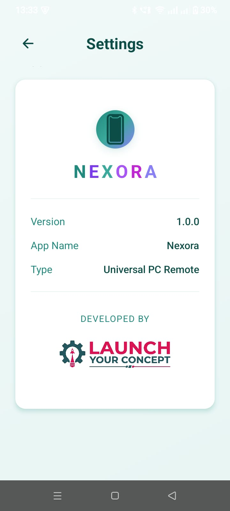 | 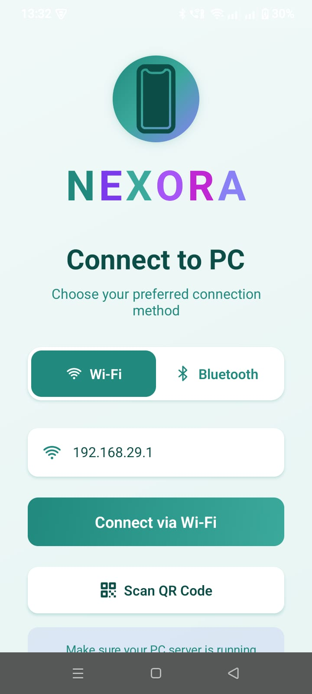 | 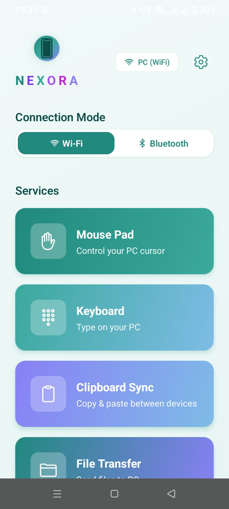 | 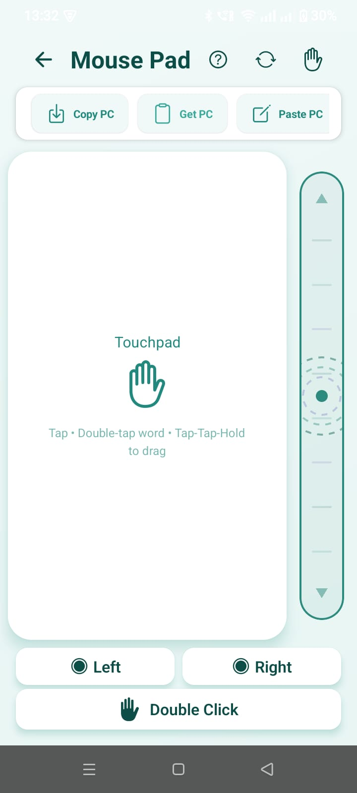 |

### Step-by-Step Connection Guide
Pairing your phone with your computer is quick and secure:

| Step 1: Read IP Details | Step 2: Input & Connect | Step 3: Check Firewall Rules |
| :---: | :---: | :---: |
| 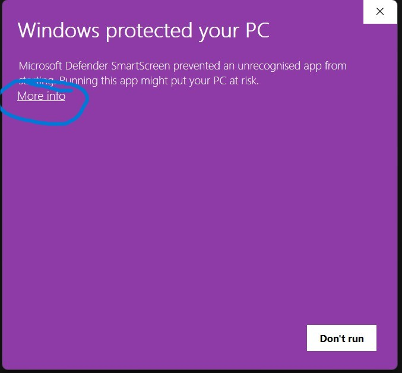 | 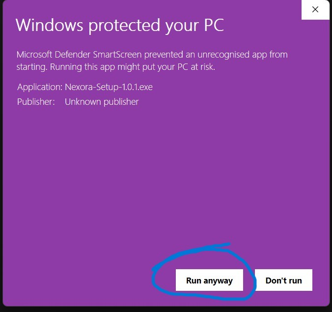 | 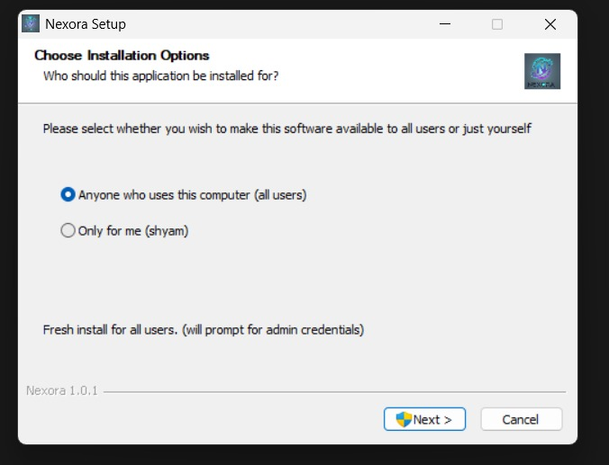 |

---

## 📄 License

Nexora is released under the **MIT License**. Feel free to use, modify, and distribute it.

*Developed with ❤️ by [Launch Your Concept](https://www.launchyourconcept.com/).*
