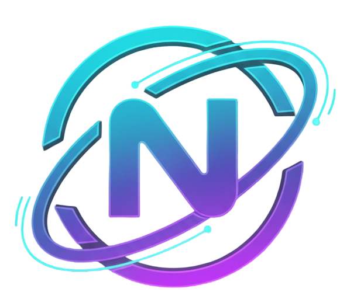

<div align="center">

# **NEXORA — UNIVERSAL PC REMOTE CONTROL**
### *Transform your mobile device into a powerful wireless trackpad, keyboard, launcher & drawing tablet for Windows*

[](https://github.com/baaghinitesh/Nexora-desktop-release/releases/latest)
[](https://github.com/baaghinitesh/Nexora-desktop-release/releases/latest)
[](https://github.com/baaghinitesh/Nexora-desktop-release/releases/latest)
[](https://github.com/baaghinitesh/Nexora-desktop-release/releases/latest)
[](LICENSE)

<br />


<br /><br />

**[💻 Download Windows Desktop App (.exe)](https://github.com/baaghinitesh/Nexora-desktop-release/releases/latest)**
&nbsp;&nbsp;·&nbsp;&nbsp;
**[📱 Download Android Mobile App (.apk)](https://github.com/baaghinitesh/Nexora-desktop-release/releases/latest)**
&nbsp;&nbsp;·&nbsp;&nbsp;
**[🌐 Official Website](https://www.launchyourconcept.com)**
&nbsp;&nbsp;·&nbsp;&nbsp;
**[📬 Support & Contact](https://www.launchyourconcept.com/contact)**

</div>

---

## 🌟 Overview

<div align="center">
  
</div>

**Nexora** is a high-performance wireless PC control ecosystem that turns your Android smartphone into an ultra-low-latency remote command hub for your Windows computer. Whether you want to navigate with precision multi-touch trackpad gestures, launch 50+ desktop apps and websites with a single tap, sync your clipboard bi-directionally, draw live annotations on your PC screen, or transfer large files at 40+ MB/s — Nexora handles it all locally over your Wi-Fi network with zero cloud dependency.

Nexora is designed, engineered, and maintained by **[Launch Your Concept](https://www.launchyourconcept.com/)**.

---

## 🚀 Quick Download & Installation

<div align="center">

| 💻 Nexora Desktop (Windows) | 📱 Nexora Mobile (Android) |
| :---: | :---: |
| [-0284c7?style=for-the-badge&logo=windows&logoColor=white)](https://github.com/baaghinitesh/Nexora-desktop-release/releases/latest) | [-10b981?style=for-the-badge&logo=android&logoColor=white)](https://github.com/baaghinitesh/Nexora-desktop-release/releases/latest) |
| **Latest: v1.0.4**<br />*Windows 10 & 11 (64-bit)* | **Latest: v1.0.7**<br />*Android 8.0 or higher* |

</div>

### 3-Step Setup:
1. **Desktop (Windows)**:
   - Download **`Nexora-Setup.exe`** from the [Latest Release](https://github.com/baaghinitesh/Nexora-desktop-release/releases/latest).
   - Run the installer. Windows firewall rules and background services configure automatically.
   - Launch Nexora Desktop to display your local IP and QR pairing code.
2. **Mobile (Android)**:
   - Download **`Nexora-Mobile.apk`** from the [Latest Release](https://github.com/baaghinitesh/Nexora-desktop-release/releases/latest).
   - Install the APK on your Android phone.
   - Open Nexora Mobile, tap **Connect**, and scan the QR code on your PC screen!

---

## ✨ Features & Capabilities

```
┌────────────────────────────────────────────────────────────────────────┐
│                        NEXORA FEATURE SUITE                            │
├───────────────────┬───────────────────┬────────────────────────────────┤
│ 🚀 App Launcher   │ 🖱️ Smart Touchpad │ ⌨️ Advanced Keyboard           │
│ 📋 Clipboard Sync │ 🖊️ Pen Tablet Draw│ 📁 High-Speed File Transfer    │
│ 🔍 Auto-Discovery │ 🔒 Local Security │ 🔄 Seamless Auto-Updates       │
└───────────────────┴───────────────────┴────────────────────────────────┘
```

### 🚀 1-Tap App & Website Launcher
- **Instant Launch**: One-tap shortcut execution on PC for 50+ preset websites and desktop applications (YouTube, ChatGPT, GitHub, VS Code, Settings, Personalisation, File Explorer, Downloads, Control Panel, etc.).
- **Multi-Tier Execution Engine**: Direct Electron Shell API + Windows `rundll32` protocol handler + `cmd.exe /c start` fallback for instant opening with zero delay.
- **100% Customizable**: Add your own custom website URLs and desktop executables, choose from 60+ vector icons, set theme colors, and manage favorites.

### 🖱️ Smart Touchpad with Drag-Select
- **Native Double-Tap-and-Drag**: Double-tap and hold to seamlessly highlight/select text, drag windows, and select blocks of code just like a real PC trackpad.
- **Ultra-Low Latency (<5ms)**: UDP streaming for real-time cursor responsiveness.
- **Full Gesture Suite**: Two-finger fluid scrolling, pinch-to-zoom, two-finger right-click, three-finger middle-click, and dedicated infinite scrollbar.

### ⌨️ Advanced PC Keyboard & Media Center
- **Full Unicode & Emoji Typing**: Real-time C# `SendUnicodeString` key injection enables typing all characters and emojis (😀🔥⚡) directly into any Windows app.
- **Media & Volume Control**: Dedicated buttons for Play/Pause, Next Track, Previous Track, Stop, Mute, Volume Down, and Volume Up.
- **Navigation & Function Keys**: Browser Back, Browser Forward, F5 Refresh, PgUp, PgDn, Home, End, F1–F12, and directional arrow pads.
- **System Shortcuts**: One-tap Snipping Tool (`Win+Shift+S`), PrintScreen (`PrtSc`), Task Manager (`Ctrl+Shift+Esc`), Lock PC (`Win+L`), and Windows Run (`Win+R`).

### 📋 Real-Time Clipboard Synchronization
- **Bidirectional Mirroring**: Copy text on PC and instantly paste on phone, or copy on phone and paste on PC.
- **Clipboard History**: Access recent clips and sync automatically in the background.

### 🖊️ Interactive Pen Tablet & Screen Annotation
- **Live Desktop Overlay**: Mirror drawing strokes from your mobile canvas directly onto a transparent, always-on-top Windows Ghost Window overlay.
- **Stylus & Color Tools**: Stylus pressure simulation, customizable stroke widths, rainbow color palette, grid mode, and 1-tap PDF / PNG export.

### 📁 High-Speed File Transfer
- **40+ MB/s Wi-Fi Speed**: Chunked streaming pipeline with SHA-256 integrity verification.
- **Direct PC Integration**: Transferred photos, videos, and archives land directly in your Windows `Downloads / Nexora Transferred Files` folder.

---

## 📸 Application Showcase

### Desktop Control Panel & Dashboard
The desktop dashboard gives you real-time connection status, connected mobile devices, firewall status, and file transfer queues:

| Dashboard View | File Transfers Queue | Active Settings |
| :---: | :---: | :---: |
|  |  |  |

### Mobile Remote Control Interfaces
Intuitive, dark-mode native mobile screens designed for speed and comfort:

| App Launcher & Services | Touchpad with Drag-Select | Advanced PC Keyboard | Pen Tablet Draw |
| :---: | :---: | :---: | :---: |
|  |  |  |  |

---

## 📱 Connection Methods

### Method 1: Wi-Fi Network (Recommended)
1. Connect your PC and Android phone to the same local Wi-Fi router.
2. Open **Nexora Desktop** on your PC to view the connection QR code.
3. Open **Nexora Mobile**, tap **Connect**, and point your camera at the QR code.

### Method 2: Mobile Hotspot (No Wi-Fi Router Needed)
1. Turn on **Mobile Hotspot** on your Windows PC (*Settings → Network & Internet → Mobile hotspot*).
2. Connect your Android phone to the PC hotspot.
3. Open Nexora Mobile — it will auto-detect the hotspot gateway (`192.168.137.1`). Tap **Connect**!

---

## 🔄 Seamless Auto-Updates

Nexora comes with a built-in automated update mechanism:
1. **Check**: On startup, Nexora checks the official GitHub repository for new releases.
2. **Download**: Updates are downloaded silently in the background.
3. **Apply**: A prompt will notify you when the update is ready to restart and install.

---

## 🆘 Support, Feedback & Contact

For technical support, feature requests, or inquiries:
- 🌐 **Official Website**: [launchyourconcept.com](https://www.launchyourconcept.com/)
- ✉️ **Support & Contact Form**: [launchyourconcept.com/contact](https://www.launchyourconcept.com/contact)

---

## 📄 License

Nexora is distributed under the **[MIT License](LICENSE)**.

<div align="center">

<br />

<a href="https://www.launchyourconcept.com">
  
</a>

<br /><br />

**Developed with ❤️ by [Launch Your Concept](https://www.launchyourconcept.com/)**

<sub>© 2024–2026 Launch Your Concept. All rights reserved.</sub>

</div>
