<div align="center">

<pre>
███╗   ██╗███████╗██╗  ██╗ ██████╗ ██████╗  █████╗
████╗  ██║██╔════╝╚██╗██╔╝██╔═══██╗██╔══██╗██╔══██╗
██╔██╗ ██║█████╗   ╚███╔╝ ██║   ██║██████╔╝███████║
██║╚██╗██║██╔══╝   ██╔██╗ ██║   ██║██╔══██╗██╔══██║
██║ ╚████║███████╗██╔╝ ██╗╚██████╔╝██║  ██║██║  ██║
╚═╝  ╚═══╝╚══════╝╚═╝  ╚═╝ ╚═════╝ ╚═╝  ╚═╝╚═╝  ╚═╝
</pre>

### Your Phone. Your PC. Zero Cloud. Zero Limits. 100% Private.

**Trackpad · 11-Row Mechanical Keypad & Voice Hub · App Launcher · Pen Tablet Drawing · Clipboard Sync · Fast File Transfer**
*Ultra-low latency wireless communication over your private local network — no third-party servers, no accounts.*

<br />

[](https://apps.microsoft.com/detail/9P6DZKBRT77H?hl=en-us&gl=IN&ocid=pdpshare)
[](https://play.google.com/store/apps/details?id=com.nexoracli)
[](https://github.com/baaghinitesh/Nexora-desktop-release/releases/latest)

<br /><br />

[](https://github.com/baaghinitesh/Nexora-desktop-release/releases/latest)
[](https://play.google.com/store/apps/details?id=com.nexoracli)
[](LICENSE)
[](https://www.launchyourconcept.com)

<br />


<br /><br />

**[Download Windows Desktop App (.exe)](https://github.com/baaghinitesh/Nexora-desktop-release/releases/latest/download/Nexora-Setup.exe)**
&nbsp;&nbsp;•&nbsp;&nbsp;
**[Download Android Mobile App (.apk)](https://github.com/baaghinitesh/Nexora-desktop-release/releases/latest/download/Nexora-Mobile.apk)**
&nbsp;&nbsp;•&nbsp;&nbsp;
**[Microsoft Store](https://apps.microsoft.com/detail/9P6DZKBRT77H?hl=en-us&gl=IN&ocid=pdpshare)**
&nbsp;&nbsp;•&nbsp;&nbsp;
**[Official Website](https://www.launchyourconcept.com)**
&nbsp;&nbsp;•&nbsp;&nbsp;
**[Contact Support](https://www.launchyourconcept.com/contact)**

</div>

---

## What is Nexora?

**Nexora** turns your Android smartphone into a full wireless remote control hub for your Windows PC. No cables. No cloud. No accounts. Connect your phone and PC to the same Wi-Fi — or use your PC's built-in Mobile Hotspot — and you're in complete control in seconds.

Whether you're presenting across the room, relaxing on the couch, coding at your desk, or teaching a class, Nexora puts the full power of your PC in your hand.

Nexora is a **two-part system**: a lightweight Windows desktop app that runs in your system tray, paired with an Android companion app. They connect via QR code scan in under 10 seconds.

> Designed, engineered, and maintained by **[Launch Your Concept](https://www.launchyourconcept.com/)**.

---

## Platform & Downloads

<div align="center">

<table>
<tr>
<td align="center" width="50%">

**Windows Desktop App**

Version &nbsp;`v1.0.8` &nbsp;·&nbsp; Windows 10 / 11 &nbsp;(64-bit)

[](https://apps.microsoft.com/detail/9P6DZKBRT77H?hl=en-us&gl=IN&ocid=pdpshare)

[](https://github.com/baaghinitesh/Nexora-desktop-release/releases/latest/download/Nexora-Setup.exe)

</td>
<td align="center" width="50%">

**Android Mobile App**

Version &nbsp;`v1.0.8` &nbsp;·&nbsp; Android 8.0 (Oreo) or higher

[](https://play.google.com/store/apps/details?id=com.nexoracli)

[](https://github.com/baaghinitesh/Nexora-desktop-release/releases/latest/download/Nexora-Mobile.apk)

</td>
</tr>
</table>

</div>

---

## Quick Start — Up and Running in 60 Seconds

**Step 1 — Install the Windows Desktop App**

Download `Nexora-Setup.exe` from the [Latest Release](https://github.com/baaghinitesh/Nexora-desktop-release/releases/latest) or install via the [Microsoft Store](https://apps.microsoft.com/detail/9P6DZKBRT77H?hl=en-us&gl=IN&ocid=pdpshare). Run the installer — Windows Firewall rules and background services configure automatically. Nexora Desktop opens showing your local IP and a live QR pairing code.

> Windows showing a SmartScreen warning when downloading from GitHub? See the [installation guide below](#installing-from-github--windows-smartscreen-guide).

**Step 2 — Install the Android App**

Install from [Google Play](https://play.google.com/store/apps/details?id=com.nexoracli) or sideload the `Nexora-Mobile.apk` from [GitHub Releases](https://github.com/baaghinitesh/Nexora-desktop-release/releases/latest). Open the app on your Android device.

**Step 3 — Connect**

Make sure your phone and PC are on the same Wi-Fi network (or your PC's Mobile Hotspot). Tap **Connect** in the app and scan the QR code on your PC screen. You're in — start controlling your PC immediately.

> **First-time only.** The very first connection requires a QR scan or PIN entry to pair your devices. After that, Nexora remembers your PC automatically — just open the app and it reconnects instantly with no scan or PIN needed.

---

## Works on Wi-Fi & Mobile Hotspot

Nexora works on any local network with no internet connection required:

- **Home / Office Wi-Fi** — connect phone and PC to the same router
- **PC Mobile Hotspot** — enable Windows Mobile Hotspot, connect your phone to it, and Nexora auto-detects the connection with no external router needed
- **Phone Hotspot** — connect your PC to your phone's hotspot and pair normally
- **Fully Offline** — zero internet required; all data stays on your local network

---

## Features

| Feature | Details |
| :--- | :--- |
| **Smart Trackpad** | Multi-touch trackpad with sub-5ms latency, native text drag-selection, two-finger scroll, pinch-to-zoom, drag lock |
| **11-Row Mechanical Keyboard** | Complete PC keyboard rebuilt for mobile — F-keys, symbols, macros, latchable modifiers, browser shortcuts, voice typing |
| **One-Tap App Launcher** | Launch 50+ desktop apps, websites, and Windows settings instantly; unlimited custom apps supported |
| **Pen Tablet & Screen Drawing** | Draw live on a transparent fullscreen desktop overlay — annotate, present, teach over any open app |
| **Clipboard Sync** | Automatic bi-directional clipboard mirroring between phone and PC with searchable history |
| **Fast File Transfer** | Transfer files at 40+ MB/s directly to your PC Downloads folder — no size limit |
| **Voice Dictation** | Real-time speech-to-text with smart punctuation engine; types directly into any PC application |
| **100% Private & Local** | Zero cloud, zero accounts, zero telemetry — everything stays on your private network |

---

## Smart Trackpad & Gestures

Your phone screen becomes a high-precision multi-touch trackpad. Mouse movements stream over UDP at sub-5ms latency — responsive enough to feel like a physical device.

| Gesture | Action |
| :--- | :--- |
| 1-Finger Swipe | Cursor movement |
| 1-Finger Tap | Left click |
| 2-Finger Tap | Right click |
| 3-Finger Tap | Middle click |
| Double-Tap & Slide | Drag windows / select text |
| Long-Press (320ms) | Drag lock with haptic confirmation |
| 2-Finger Slide | Scroll vertically or horizontally |
| Pinch to Zoom | Ctrl + Mouse Wheel (zoom in / out) |
| Side Scrollbar | Rapid traversal through long documents |

Sensitivity, pointer acceleration, scroll direction, and haptic intensity are all adjustable from the mobile settings screen.

[Full Trackpad Documentation](docs/touchpad.md)

---

## 11-Row Mechanical Keyboard & Voice Hub

Nexora's keyboard is not an on-screen phone keyboard. It is a **complete PC keyboard reimagined for a small screen** — every key you need, organized into 11 scrollable rows with 3D mechanical styling, color-coded rows, and shortcut keys built in.

```
+--------------------------------------------------------------------------------------+
|  HEADER: Connection Status  |  [Soft-KB]  [Auto / Buffer Mode]  [Help]              |
+--------------------------------------------------------------------------------------+
|  TEXT BUFFER & SPEECH:  [ Enlarged Typing Area ]  [ Mic ]  [ Clear ]  [ Send ]      |
+--------------------------------------------------------------------------------------+
|  QUICK LAUNCH:  [ VS Code ]  [ Chrome ]  [ Spotify ]  [ YouTube ]  [ + More ]       |
+--------------------------------------------------------------------------------------+
|  ROW  1:  F1   F2   F3   F4   F5   F6          Mute   Vol-   Vol+                   |
|  ROW  2:  F7   F8   F9   F10  F11  F12         Prev   Play   Next                   |
|  ROW  3:  Win+D  Win+E  Win+V  Win+L  Snip  TaskMgr  Alt+Tab  Alt+F4               |
|  ROW  4:  +Tab  xTab  Reopen  URL  Find  Reload  Dev  Zoom+  Zoom-                  |
|  ROW  5:  Esc  Tab  Caps  PrtScn  ScrLk  Pause  Backspace  Del                      |
|  ROW  6:  <-- Scrollable Numbers   1  2  3  4  5  6  7  8  9  0 -->                 |
|  ROW  7:  <-- Scrollable Alphabet  A  B  C  D  E  ...  Z  (syncs with Caps/Shift) ->|
|  ROW  8:  <-- 32-Symbol Strip  ~ ` ! @ # $ % ^ & * ( ) - _ = + [ ] { } \ | ; -->   |
|  ROW  9:  Shift  Ctrl  Alt  Win  |  Copy  Paste  Cut  All  Undo  Redo  Save         |
|  ROW 10:  Home  End  PgUp  PgDn  [ ENTER ]  |  Ins  Up                             |
|  ROW 11:  Ctrl  Alt  [========= SPACEBAR =========]  Menu  |  Left  Down  Right     |
+--------------------------------------------------------------------------------------+
```

**What sets it apart:**

- **Latchable modifiers** — tap Shift, Ctrl, Alt, or Win to lock them on; they glow while active and release after the next key press
- **Dedicated shortcut rows** — Windows system commands, browser controls, and media keys on dedicated rows
- **1-tap macros** — Copy, Paste, Cut, Select All, Undo, Redo, Save
- **Scrollable symbol strip** — all 32 programming symbols in a horizontal scroll row
- **Auto Mode vs Buffer Mode** — stream keystrokes live as you type, or compose locally and send all at once
- **Soft keyboard integration** — invoke your phone's native keyboard (Gboard, SwiftKey, Samsung) for multilingual input and autocorrect

**Built-in Voice Dictation Engine**

Tap the mic and speak naturally. Nexora transcribes in real time and types directly into any focused PC application — Word, Notepad, VS Code, browsers, terminals, anything.

Smart punctuation converts spoken keywords into formatted text:

| Say | Gets typed |
| :--- | :--- |
| `"Hello world comma how are you"` | `Hello world, how are you` |
| `"Project complete period new paragraph next steps colon"` | `Project complete.` + new paragraph + `Next steps:` |
| `"user at symbol domain dot com"` | `user@domain.com` |

[Full Keyboard & Voice Documentation](docs/keyboard.md)

---

## One-Tap App & Web Launcher

Launch any desktop application, website, or Windows setting from your phone with a single tap. Nexora ships preloaded with **50+ curated shortcuts** across every category:

| Category | Examples |
| :--- | :--- |
| **Web & Search** | Google, ChatGPT, Claude AI, Wikipedia, Bing |
| **Social & Communication** | WhatsApp Web, Discord, Telegram, Reddit, Twitter / X, LinkedIn |
| **Productivity** | Notion, Google Docs, Google Drive, Figma, Slack, Trello |
| **Media & Entertainment** | YouTube, Spotify, Netflix, Twitch, YouTube Music, Prime Video |
| **Dev & Terminal** | VS Code, Windows Terminal, PowerShell, CMD, GitHub, Stack Overflow |
| **Windows System** | File Explorer, Task Manager, Settings, Control Panel, Calculator, Snipping Tool |
| **Windows Personalisation** | Themes, Display, Sound, Bluetooth, Network — all 1-tap |

Starred favorites sync automatically to the Quick Launch bar on the Keyboard screen so your top apps are always one tap away even while typing.

Add **unlimited custom apps** — point to any `.exe`, URL, URI scheme (`steam://`, `spotify:`), PowerShell script, or folder path.

[Full App Launcher Documentation](docs/app_launcher.md)

---

## Pen Tablet & Live Screen Drawing

Your phone becomes a **wireless drawing tablet**. Nexora opens a transparent, always-on-top Ghost Window overlay across your entire PC desktop and mirrors your drawing strokes onto it in real time.

Draw on top of any open application — PowerPoint, PDF, VS Code, a Zoom or Teams screen share — without switching windows or interrupting your workflow.

**Tools included:** Pen, Highlighter, Eraser, multi-level Undo / Redo, color palette with opacity control, and background grid templates (blank, lined, isometric grid).

**Export:** tap Export on your phone to save annotations as a high-resolution **PNG** or **multi-page PDF**, automatically delivered to your PC Downloads folder.

[Full Pen Tablet Documentation](docs/drawing_tablet.md)

---

## Clipboard Sync

Copy something on your PC — paste it on your phone. Copy something on your phone — paste it on your PC. Clipboard sync is automatic and bi-directional with zero extra steps required.

- Timestamped history for both directions
- Searchable history so you can retrieve something copied earlier
- Encrypted in transit over your local LAN

---

## High-Speed File Transfer

Transfer photos, videos, documents, or large archives between phone and PC at **30–45+ MB/s** over Wi-Fi — no cables, no third-party apps, no cloud uploads.

- Files land directly in `Downloads\Nexora Transferred Files` on your PC
- SHA-256 checksum verification on every transfer guarantees byte-perfect integrity
- Real-time speedometer and progress bar
- Pause, resume, and cancel controls for large transfers
- Built-in file browser in the desktop app to open or locate received files
- No file size limit — tested with 20+ GB ISO images

[Full File Transfer Documentation](docs/file_transfer.md)

---

## Privacy & Security

Nexora was built with privacy as a core design principle, not an afterthought.

- **100% Local LAN** — all data (mouse, keyboard, clipboard, files) travels only between your phone and PC over your private Wi-Fi network. Nothing touches the internet.
- **Zero Accounts** — no registration, no email address, no password, no profile required.
- **Zero Cloud** — no telemetry, no analytics, no keystroke logging, no data collection of any kind.
- **QR + PIN Authentication** — pairing requires scanning the QR code or entering the 4-digit PIN displayed on your PC. Unauthorized devices are rejected automatically.
- **Offline Capable** — works without an internet connection on private or air-gapped networks.

[Full Security & Privacy Documentation](docs/SECURITY_AND_PRIVACY.md)

---

## Technical Architecture

Nexora uses a purpose-built multi-protocol communication stack optimized for private local networks:

| Protocol | Port | Purpose |
| :--- | :---: | :--- |
| UDP Datagrams | `8081` | Mouse movement — sub-5ms latency, fire-and-forget |
| WebSocket | `8080` | Keyboard input, clipboard sync, drawing strokes, real-time events |
| HTTP REST API | `3000` | Device pairing, QR code generation, file transfer streaming |
| mDNS / Bonjour | `5353` | Automatic zero-config LAN device discovery |

The Windows desktop app is built on **Electron + Node.js**. Keystrokes are injected via a native **Win32 `SendInput` / `SendUnicodeString` C# bridge**, giving full Unicode, emoji, and special character support in every application.

[Full Architecture Documentation](docs/ARCHITECTURE.md)

---

## App Screenshots

### Desktop App

<div align="center">

| Dashboard & QR Pairing | Clipboard Manager | Settings |
| :---: | :---: | :---: |
| 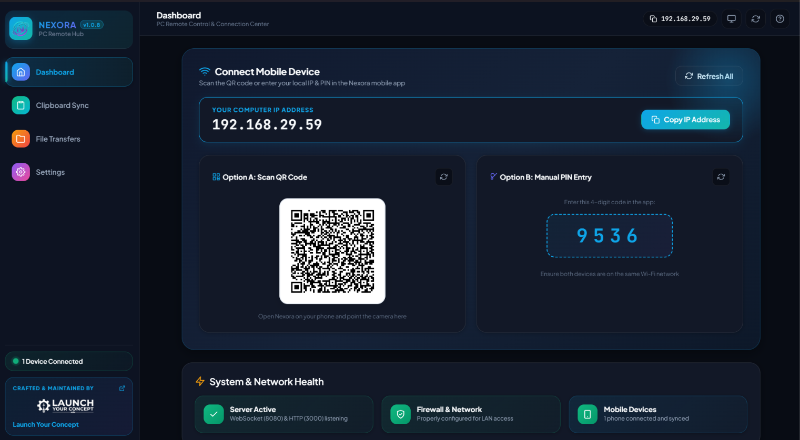 | 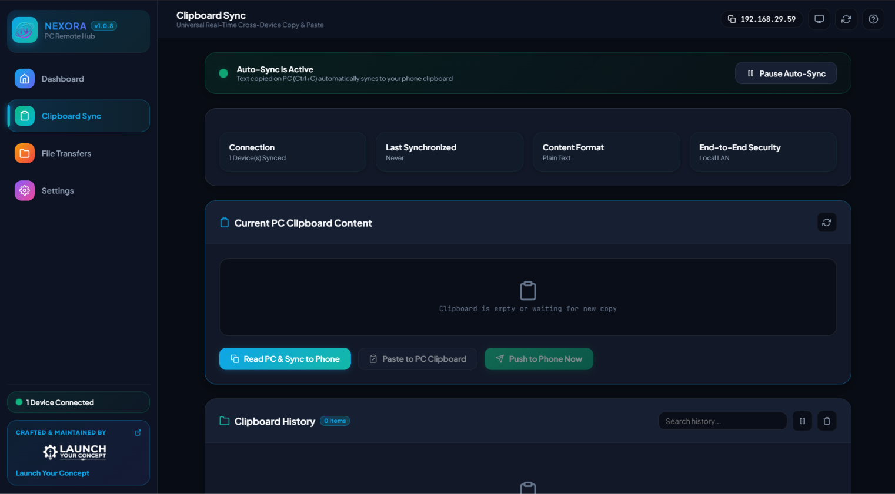 | 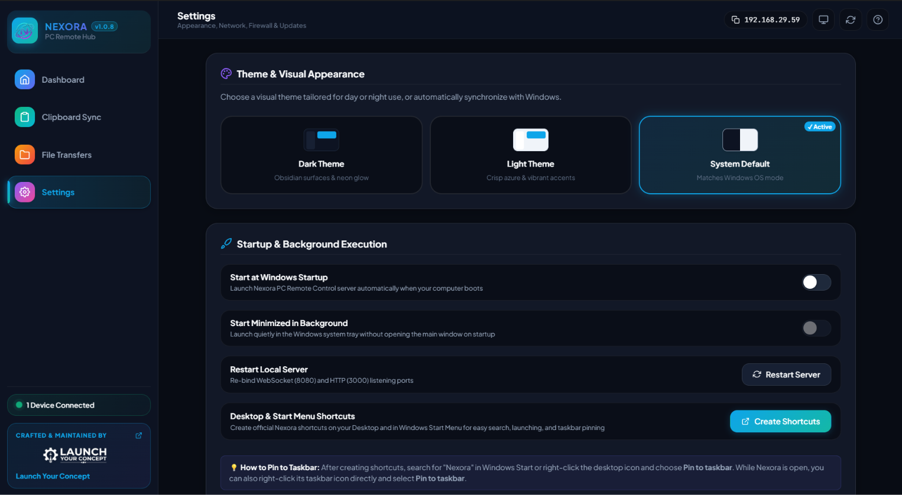 |

</div>

---

### Mobile App

<div align="center">

| Home | Connect to PC | App Launcher | Trackpad |
| :---: | :---: | :---: | :---: |
| 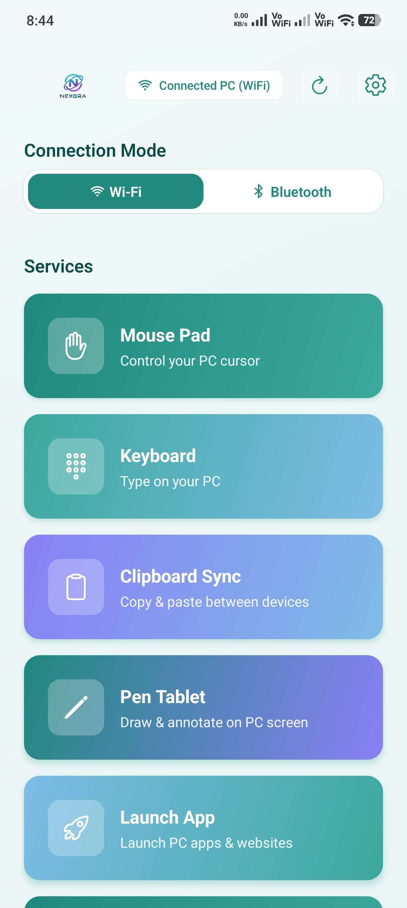 | 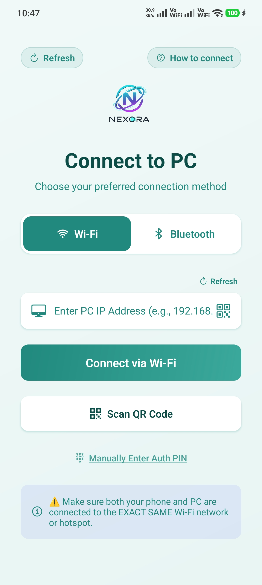 | 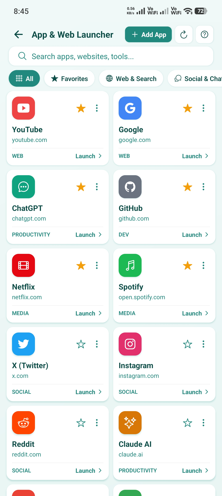 | 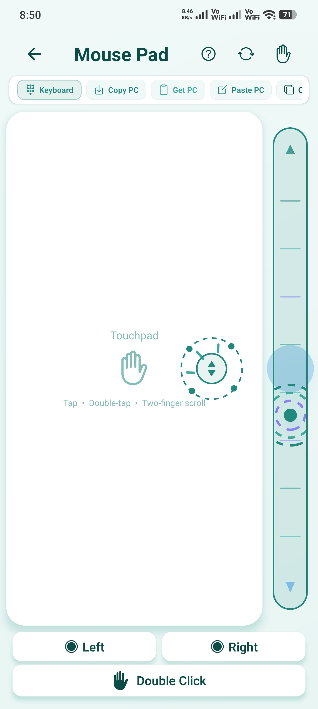 |

| Keyboard | Pen Tablet | Pen Tablet Drawing | Settings |
| :---: | :---: | :---: | :---: |
| 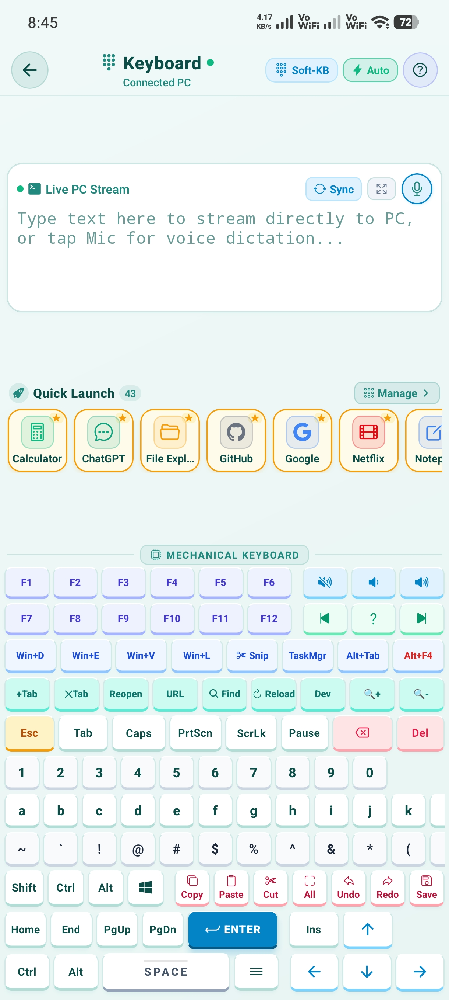 | 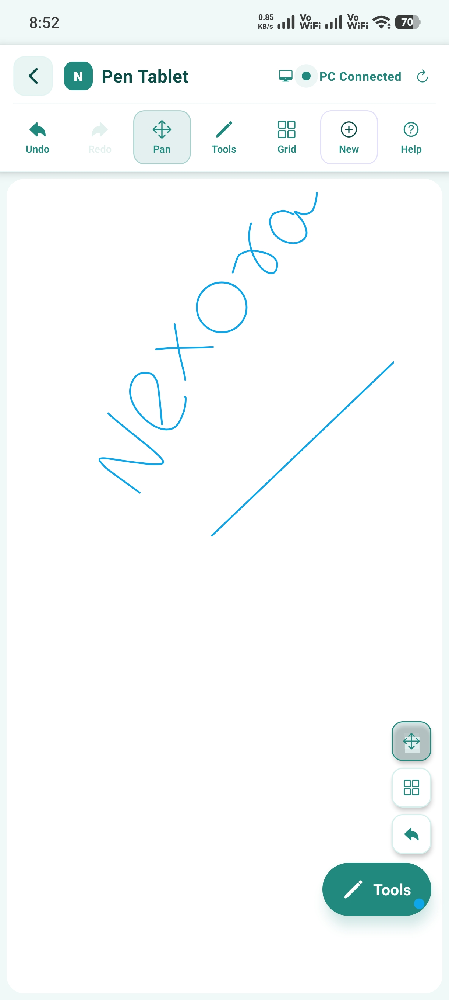 | 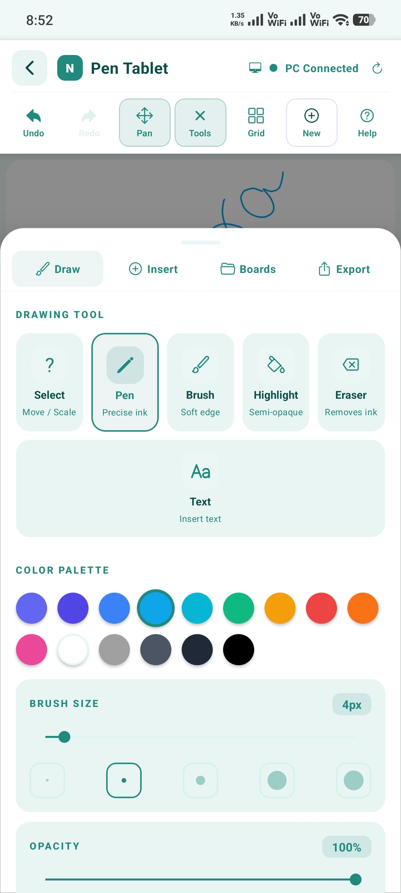 | 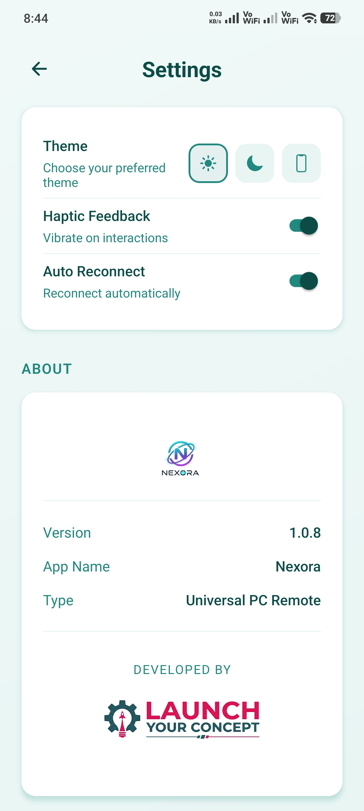 |

</div>

---

## Installing from GitHub — Windows SmartScreen Guide

When downloading `Nexora-Setup.exe` directly from GitHub, Windows Defender SmartScreen may show a warning because the installer is not yet signed by a paid Microsoft certificate. The app is completely safe. Here is how to proceed:

**Step 1 — When SmartScreen appears, click "More info"**

<div align="center">

</div>

<br />

**Step 2 — Click "Run anyway"**

<div align="center">

</div>

<br />

**Step 3 — Allow the installer to complete**

<div align="center">

</div>

<br />

> To skip this entirely, install from the [Microsoft Store](https://apps.microsoft.com/detail/9P6DZKBRT77H?hl=en-us&gl=IN&ocid=pdpshare) — fully verified, no warnings, and automatic updates included.

---

## Documentation

| Guide | Contents |
| :--- | :--- |
| [System Architecture](docs/ARCHITECTURE.md) | Multi-protocol stack, Electron IPC, Win32 SendInput bridge |
| [Smart Trackpad](docs/touchpad.md) | Gesture matrix, UDP streaming, sensitivity settings |
| [Mechanical Keyboard & Voice](docs/keyboard.md) | All 11 rows explained, voice punctuation table, streaming modes |
| [App Launcher](docs/app_launcher.md) | Full preset catalog, custom apps, starred favorites |
| [Pen Tablet & Drawing](docs/drawing_tablet.md) | Ghost Window overlay, drawing tools, export pipeline |
| [Clipboard Sync](docs/clipboard.md) | Bi-directional sync, history, encryption |
| [File Transfer](docs/file_transfer.md) | Transfer pipeline, speeds, pause / resume |
| [Network & Discovery](docs/network_discovery.md) | QR pairing, mDNS, hotspot mode, port map |
| [Security & Privacy](docs/SECURITY_AND_PRIVACY.md) | LAN-only architecture, zero telemetry, authentication |
| [Troubleshooting](docs/troubleshooting.md) | Firewall setup, connectivity FAQ, diagnostics |

---

<div align="center">

<br />

<a href="https://www.launchyourconcept.com/projects">
  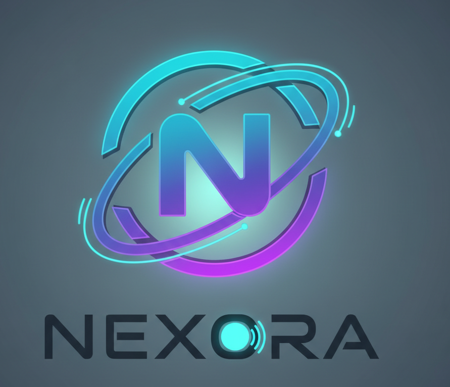
</a>

<br /><br />

<a href="https://www.launchyourconcept.com">
  
</a>

<br /><br />

Nexora is built and maintained by **[Launch Your Concept](https://www.launchyourconcept.com/)** — a software studio focused on building practical tools that respect user privacy.

<br />

**[Official Website](https://www.launchyourconcept.com/)** &nbsp;&nbsp;|&nbsp;&nbsp; **[All Projects](https://www.launchyourconcept.com/projects)** &nbsp;&nbsp;|&nbsp;&nbsp; **[Google Play](https://play.google.com/store/apps/details?id=com.nexoracli)** &nbsp;&nbsp;|&nbsp;&nbsp; **[Microsoft Store](https://apps.microsoft.com/detail/9P6DZKBRT77H?hl=en-us&gl=IN&ocid=pdpshare)** &nbsp;&nbsp;|&nbsp;&nbsp; **[Contact & Support](https://www.launchyourconcept.com/contact)**

<br />

<sub>© 2024–2026 Launch Your Concept. All rights reserved.</sub>

</div>
