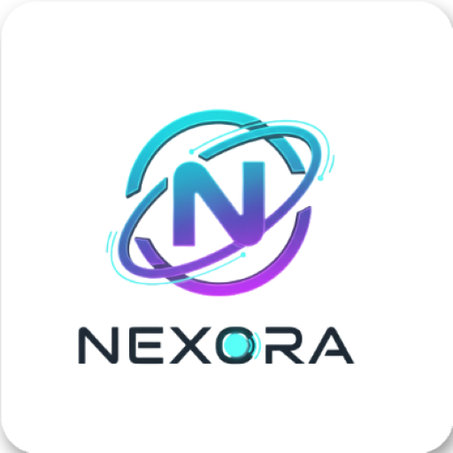

<div align="center">

<pre>
███╗   ██╗███████╗██╗  ██╗ ██████╗ ██████╗  █████╗
████╗  ██║██╔════╝╚██╗██╔╝██╔═══██╗██╔══██╗██╔══██╗
██╔██╗ ██║█████╗   ╚███╔╝ ██║   ██║██████╔╝███████║
██║╚██╗██║██╔══╝   ██╔██╗ ██║   ██║██╔══██╗██╔══██║
██║ ╚████║███████╗██╔╝ ██╗╚██████╔╝██║  ██║██║  ██║
╚═╝  ╚═══╝╚══════╝╚═╝  ╚═╝ ╚═════╝ ╚═╝  ╚═╝╚═╝  ╚═╝
</pre>

### 60+ Remote PC Controls. Zero Cloud Uploads. Zero Limits. 100% Private.

**Trackpad · 11-Row Mechanical Keypad & Voice Hub · App Launcher · Pen Tablet Drawing · Clipboard Sync · Fast File Transfer**
*Ultra-low latency wireless communication over your private local network — no third-party servers, no accounts.*

<br />

[](https://apps.microsoft.com/detail/9P6DZKBRT77H?hl=en-us&gl=IN&ocid=pdpshare)
[](https://play.google.com/store/apps/details?id=com.nexoracli)
[](https://github.com/baaghinitesh/Nexora-desktop-release/releases/latest)

<br /><br />

[](https://github.com/baaghinitesh/Nexora-desktop-release/releases/latest)
[](https://play.google.com/store/apps/details?id=com.nexoracli)
[](LICENSE)
[](https://www.launchyourconcept.com)

<br />


<br /><br />

**[Download Windows Desktop App (.exe)](https://github.com/baaghinitesh/Nexora-desktop-release/releases/latest/download/Nexora-Setup.exe)**
&nbsp;&nbsp;•&nbsp;&nbsp;
**[Download Android Mobile App (.apk)](https://github.com/baaghinitesh/Nexora-desktop-release/releases/latest/download/Nexora-Mobile.apk)**
&nbsp;&nbsp;•&nbsp;&nbsp;
**[Microsoft Store](https://apps.microsoft.com/detail/9P6DZKBRT77H?hl=en-us&gl=IN&ocid=pdpshare)**
&nbsp;&nbsp;•&nbsp;&nbsp;
**[Official Website](https://www.launchyourconcept.com)**
&nbsp;&nbsp;•&nbsp;&nbsp;
**[Contact Support](https://www.launchyourconcept.com/contact)**

</div>

---

## 🌟 What is Nexora?

**Nexora** turns your Android smartphone into a full remote command hub for your Windows PC — wirelessly, privately, and instantly. No cables. No cloud. No accounts. Just connect your phone and PC to the same Wi-Fi (or your PC's Mobile Hotspot) and you're in control.

Whether you're across the room presenting, lying on your couch browsing, coding at your desk, or teaching a class — Nexora gives you the full power of your PC from the palm of your hand.

Nexora is a **two-part system**: a lightweight Windows desktop app that runs in your system tray, and a companion Android app. They pair in seconds via QR code scan over your local network.

> Designed, engineered, and maintained by **[Launch Your Concept](https://www.launchyourconcept.com/)**.

<br />

<div align="center">

| 🖥️ Windows Desktop App | 📱 Android Companion App |
| :--- | :--- |
| Latest Version: `v1.0.8` | Latest Version: `v1.0.8` |
| Requires: Windows 10 / 11 (64-bit) | Requires: Android 8.0 (Oreo) or higher |
| [Microsoft Store](https://apps.microsoft.com/detail/9P6DZKBRT77H?hl=en-us&gl=IN&ocid=pdpshare) · [Direct .exe](https://github.com/baaghinitesh/Nexora-desktop-release/releases/latest/download/Nexora-Setup.exe) | [Google Play](https://play.google.com/store/apps/details?id=com.nexoracli) · [Direct .apk](https://github.com/baaghinitesh/Nexora-desktop-release/releases/latest/download/Nexora-Mobile.apk) |

</div>

---

## ⚡ Quick Start — Up and Running in 60 Seconds

### Step 1 — Install the Windows Desktop App

1. Download **`Nexora-Setup.exe`** from the [Latest Release](https://github.com/baaghinitesh/Nexora-desktop-release/releases/latest) or get it from the [Microsoft Store](https://apps.microsoft.com/detail/9P6DZKBRT77H?hl=en-us&gl=IN&ocid=pdpshare).
2. Run the installer — Windows Firewall rules and background services configure automatically.
3. Nexora Desktop opens showing your local IP address and a live QR pairing code.

> **⚠️ Windows Security Warning when downloading from GitHub?** See the [installation instructions below](#-installing-from-github-windows-smartscreen-guide).

### Step 2 — Install the Android App

1. Get the app from [Google Play](https://play.google.com/store/apps/details?id=com.nexoracli) or download the **`Nexora-Mobile.apk`** directly from [GitHub Releases](https://github.com/baaghinitesh/Nexora-desktop-release/releases/latest).
2. Install and open the app on your Android device.

### Step 3 — Connect

1. Make sure your phone and PC are on the **same Wi-Fi network** (or your PC's Mobile Hotspot).
2. Tap **Connect** in the app and scan the QR code on your PC screen.
3. You're connected. Start controlling your PC immediately.

---

## 🌐 Works on Wi-Fi & Mobile Hotspot

Nexora works on **any local network** — no internet connection required:

- **Home / Office Wi-Fi** — connect phone and PC to the same router.
- **PC Mobile Hotspot** — turn on Windows Mobile Hotspot, connect your phone to it, and Nexora auto-detects the connection. No external router needed.
- **Phone Hotspot** — connect your PC's Wi-Fi to your phone's hotspot and pair normally.
- **Fully Offline** — Nexora functions with zero internet access. Everything stays on your local network.

---

## ✨ Features at a Glance

| Feature | What it Does |
| :--- | :--- |
| 🖱️ **Smart Trackpad** | Multi-touch trackpad with <5ms latency, text drag-selection, scrolling, pinch-to-zoom |
| ⌨️ **11-Row Mechanical Keyboard** | Full desktop keyboard rebuilt for mobile — F-keys, symbols, macros, holdable modifiers, voice typing |
| 🚀 **One-Tap App Launcher** | Launch 50+ desktop apps, websites, and Windows settings with a single tap |
| 🖊️ **Pen Tablet & Screen Drawing** | Draw live on a transparent desktop overlay — annotate, present, teach |
| 📋 **Clipboard Sync** | Bi-directional clipboard mirroring between phone and PC with history |
| 📁 **Fast File Transfer** | Transfer files at 40+ MB/s directly to your PC Downloads folder |
| 🎙️ **Voice Dictation** | Real-time speech-to-text with smart punctuation engine |
| 🔒 **100% Private** | Everything on your local network — zero cloud, zero accounts, zero telemetry |

---

## 🖱️ Smart Trackpad & Gestures

Your phone screen becomes a high-precision multi-touch trackpad. Mouse movements stream over **UDP at sub-5ms latency** — faster than most wired keyboards respond.

| Gesture | Action |
| :--- | :--- |
| 1-Finger Swipe | Cursor movement |
| 1-Finger Tap | Left click |
| 2-Finger Tap | Right click |
| 3-Finger Tap | Middle click |
| Double-Tap & Slide | Drag windows / select text |
| Long-Press (320ms) | Drag lock with haptic feedback |
| 2-Finger Slide | Scroll vertically or horizontally |
| Pinch to Zoom | Ctrl + Mouse Wheel (zoom in/out) |
| Side Scrollbar | Rapid traversal through long documents |

Sensitivity, acceleration, scroll direction, and haptic intensity are all adjustable in settings.

→ [Full Trackpad Documentation](docs/touchpad.md)

---

## ⌨️ 11-Row Mechanical Keyboard & Voice Hub

Nexora doesn't just give you an on-screen keyboard — it gives you a **fully redesigned mechanical keyboard built for mobile**. It packs everything a full desktop keyboard has into an elegant 11-row scrollable layout, with tactile styling, shortcut keys, and everything you actually use.

```
┌──────────────────────────────────────────────────────────────────────────────────────┐
│  HEADER: Connection Status | [Soft-KB] [Auto/Buffer Mode] [Help]                     │
├──────────────────────────────────────────────────────────────────────────────────────┤
│  TEXT BUFFER & SPEECH: [ Enlarged Typing Area ] [ 🎙️ Voice Mic ] [ Clear ] [ Send ]  │
├──────────────────────────────────────────────────────────────────────────────────────┤
│  QUICK LAUNCH: [ ⭐ VS Code ] [ ⭐ Chrome ] [ Spotify ] [ YouTube ] [ + More... ]     │
├──────────────────────────────────────────────────────────────────────────────────────┤
│  ROW 1:  F1  F2  F3  F4  F5  F6        🔇 Mute   🔉 Vol–   🔊 Vol+                  │
│  ROW 2:  F7  F8  F9  F10 F11 F12       ⏮ Prev   ⏯ Play   ⏭ Next                   │
│  ROW 3:  Win+D  Win+E  Win+V  Win+L   Snip  TaskMgr  Alt+Tab  Alt+F4               │
│  ROW 4:  +Tab  ✕Tab  Reopen  URL  🔍Find  🔄Reload  Dev  Zoom+  Zoom–               │
│  ROW 5:  Esc  Tab  Caps🟢  PrtScn  ScrLk🟢  Pause  ⌫ Backspace  Del                │
│  ROW 6:  ◄─── Scrollable Numbers  1  2  3  4  5  6  7  8  9  0 ───►                │
│  ROW 7:  ◄─── Scrollable Alphabet  A  B  C  D ... Z  (syncs with Caps/Shift) ───►   │
│  ROW 8:  ◄─── 32-Symbol Strip  ~ ` ! @ # $ % ^ & * ( ) - _ = + [ ] { } \ | ; ───►  │
│  ROW 9:  Shift  Ctrl  Alt  🪟Win  |  Copy  Paste  Cut  All  Undo  Redo  Save        │
│  ROW 10: Home  End  PgUp  PgDn  ↵ ENTER (oversized)  |  Ins  ↑                     │
│  ROW 11: Ctrl  Alt  ════════ SPACEBAR ════════  ☰  |  ←  ↓  →                      │
└──────────────────────────────────────────────────────────────────────────────────────┘
```

**Highlights:**
- **Latchable modifier keys** — tap Shift, Ctrl, Alt, or Win to latch them on; they glow while active and release after the next key
- **1-tap macros** — Copy, Paste, Cut, Select All, Undo, Redo, Save
- **Browser command suite** — new tab, close tab, reopen tab, find, reload, zoom
- **Windows shortcuts** — File Explorer, Desktop, Clipboard, Lock PC, Task Manager, Snipping Tool
- **Scrollable rows** — numbers, full A–Z alphabet, and 32-symbol programming strip all scroll horizontally
- **Auto Mode vs Buffer Mode** — stream keystrokes live as you type, or draft locally and send all at once
- **Soft keyboard integration** — tap to invoke your phone's native keyboard (Gboard, Samsung, SwiftKey) for predictive text and multilingual input

### 🎙️ Built-in Voice Dictation Engine

Tap the mic and speak naturally. Nexora transcribes your voice in real time and types it directly into any focused PC application — Word, Notepad, VS Code, browsers, anything.

Smart punctuation converts spoken keywords into formatted text automatically:

| Say | Gets typed |
| :--- | :--- |
| *"Hello world comma how are you"* | `Hello world, how are you` |
| *"Project complete period new paragraph next steps colon"* | `Project complete.\n\nNext steps:` |
| *"Contact at user at symbol domain dot com"* | `Contact at user@domain.com` |

→ [Full Keyboard & Voice Documentation](docs/keyboard.md)

---

## 🚀 One-Tap App & Web Launcher

Launch any app, website, or Windows setting from your phone with a single tap. Nexora comes preloaded with **50+ curated shortcuts** across every category:

| Category | Examples |
| :--- | :--- |
| 🌐 **Web & Search** | Google, ChatGPT, Claude AI, Wikipedia, Bing |
| 💬 **Social & Communication** | WhatsApp Web, Discord, Telegram, Reddit, Twitter, LinkedIn |
| 💼 **Productivity** | Notion, Google Docs, Google Drive, Figma, Slack, Trello |
| 🎬 **Media & Entertainment** | YouTube, Spotify, Netflix, Twitch, YouTube Music, Prime Video |
| 💻 **Dev & Terminal** | VS Code, Windows Terminal, PowerShell, CMD, GitHub, Stack Overflow |
| ⚙️ **Windows System** | File Explorer, Task Manager, Settings, Control Panel, Calculator, Snipping Tool |
| 🎨 **Windows Personalisation** | Themes, Display, Sound, Bluetooth, Network settings — all 1-tap |

**Starred favorites** sync automatically to the Quick Launch bar on the Keyboard screen, so your top apps are always one tap away even while typing.

You can also **add unlimited custom apps** — point to any `.exe`, custom URL, URI scheme (`steam://`, `spotify:`), PowerShell script, or system path.

→ [Full App Launcher Documentation](docs/app_launcher.md)

---

## 🖊️ Pen Tablet & Live Screen Drawing

Turn your phone into a **wireless drawing tablet**. Nexora opens a transparent, always-on-top Ghost Window overlay across your entire PC desktop, and your finger or stylus draws on it in real time.

**Use it to:**
- Annotate PowerPoint slides or PDFs during presentations
- Highlight code or diagrams while screen sharing on Zoom, Teams, or Meet
- Sketch wireframes, diagrams, or notes over any open app
- Teach and explain visually without switching tools

**Tools included:** Pen, Highlighter, Eraser, multi-level Undo/Redo, color palette, opacity control, and background grid templates (blank, lined, isometric).

**Export:** Tap Export on your phone to save your annotations as a high-resolution **PNG** or **multi-page PDF** — automatically saved to your PC Downloads folder.

→ [Full Pen Tablet Documentation](docs/drawing_tablet.md)

---

## 📋 Clipboard Sync

Copy something on your PC — paste it on your phone. Copy something on your phone — paste it on your PC. Clipboard sync is **automatic and bi-directional** with zero extra steps.

- Timestamped clipboard history for both directions
- Searchable history so you can find something you copied earlier
- Encrypted in transit over your local LAN

---

## 📁 High-Speed File Transfer

Transfer photos, videos, documents, or large archives between your phone and PC at **30–45+ MB/s** — no cables, no third-party apps, no cloud uploads.

- Transfers land directly in `Downloads\Nexora Transferred Files` on your PC
- SHA-256 checksum verification guarantees file integrity every time
- Real-time speedometer and progress bar during transfers
- Pause, resume, and cancel controls
- Built-in file browser in the desktop app to open or locate transferred files
- No file size limit — tested with 20+ GB ISO files

→ [Full File Transfer Documentation](docs/file_transfer.md)

---

## 🔒 Privacy & Security

Nexora was designed with privacy as a **core principle**, not an afterthought.

- **100% Local** — all data (mouse, keyboard, clipboard, files) travels only between your phone and PC over your private Wi-Fi. Nothing touches the internet.
- **Zero Accounts** — no registration, no email, no password, no profile.
- **Zero Cloud** — no telemetry, no analytics, no keystroke logging, no data collection of any kind.
- **QR + PIN Authentication** — pairing requires either scanning the QR code or entering the 4-digit PIN displayed on your PC. Unauthorized devices are rejected.
- **Offline Capable** — works without an internet connection on private or air-gapped networks.

→ [Full Security & Privacy Documentation](docs/SECURITY_AND_PRIVACY.md)

---

## 🏗️ Technical Architecture

Nexora uses a purpose-built multi-protocol communication stack optimized for private local networks:

| Protocol | Port | Used For |
| :--- | :---: | :--- |
| **UDP Datagrams** | `8081` | Mouse movement — <5ms latency, fire-and-forget |
| **WebSocket** | `8080` | Keyboard, clipboard, drawing strokes, real-time events |
| **HTTP REST API** | `3000` | Device pairing, QR generation, file transfer streaming |
| **mDNS / Bonjour** | `5353` | Automatic zero-config LAN discovery |

The Windows desktop app runs as an **Electron + Node.js** application. Keystrokes are injected into any active application via a native **Win32 `SendInput` / `SendUnicodeString` C# bridge** — meaning full Unicode, emoji, and every special character works in any app.

→ [Full Architecture Documentation](docs/ARCHITECTURE.md)

---

## 📸 App Screenshots

### Desktop App

| Dashboard & QR Pairing | Clipboard Manager | Settings |
| :---: | :---: | :---: |
|  |  |  |

### Mobile App

| Home & Landing | Connect to PC | App Launcher |
| :---: | :---: | :---: |
|  |  |  |

| Smart Trackpad | Mechanical Keyboard | Pen Tablet |
| :---: | :---: | :---: |
|  |  |  |

| Pen Tablet (Drawing) | Mobile Settings | |
| :---: | :---: | :---: |
|  |  | |

---

## ⚠️ Installing from GitHub — Windows SmartScreen Guide

When downloading `Nexora-Setup.exe` directly from GitHub, Windows Defender SmartScreen may show a warning because the installer is not yet code-signed by Microsoft. **The app is completely safe.** Follow these steps to install:

**Step 1 — Click "More info" on the SmartScreen popup**


**Step 2 — Click "Run anyway"**


**Step 3 — Allow the installer to run**


> **Tip:** To avoid this entirely, install from the [Microsoft Store](https://apps.microsoft.com/detail/9P6DZKBRT77H?hl=en-us&gl=IN&ocid=pdpshare) — no warnings, automatic updates included.

---

## 📚 Full Documentation

| Guide | What's Inside |
| :--- | :--- |
| 🏗️ [System Architecture](docs/ARCHITECTURE.md) | Multi-protocol stack, Electron IPC, Win32 SendInput bridge |
| 🖱️ [Smart Trackpad](docs/touchpad.md) | Gestures, UDP streaming, sensitivity settings |
| ⌨️ [Mechanical Keyboard & Voice](docs/keyboard.md) | All 11 rows explained, voice punctuation table, streaming modes |
| 🚀 [App Launcher](docs/app_launcher.md) | Full preset catalog, custom apps, starred favorites |
| 🖊️ [Pen Tablet & Drawing](docs/drawing_tablet.md) | Ghost Window overlay, tools, export pipeline |
| 📋 [Clipboard Sync](docs/clipboard.md) | Bi-directional sync, history, encryption |
| 📁 [File Transfer](docs/file_transfer.md) | Transfer pipeline, speeds, pause/resume |
| 🌐 [Network & Discovery](docs/network_discovery.md) | QR pairing, mDNS, hotspot mode, port map |
| 🔒 [Security & Privacy](docs/SECURITY_AND_PRIVACY.md) | LAN-only architecture, zero telemetry, authentication |
| 🛠️ [Troubleshooting](docs/troubleshooting.md) | Firewall setup, connectivity FAQ, diagnostics |

---

## 🏢 About Launch Your Concept

<div align="center">

<br />

<a href="https://www.launchyourconcept.com">
  
</a>

<br /><br />

Nexora is built and maintained by **[Launch Your Concept](https://www.launchyourconcept.com/)** — a software studio focused on building practical tools that respect user privacy.

<br />

<a href="https://www.launchyourconcept.com">
  
</a>

<br /><br />

**[Official Website](https://www.launchyourconcept.com/)** &nbsp;•&nbsp; **[Google Play](https://play.google.com/store/apps/details?id=com.nexoracli)** &nbsp;•&nbsp; **[Microsoft Store](https://apps.microsoft.com/detail/9P6DZKBRT77H?hl=en-us&gl=IN&ocid=pdpshare)** &nbsp;•&nbsp; **[Contact & Support](https://www.launchyourconcept.com/contact)**

<sub>© 2024–2026 Launch Your Concept. All rights reserved.</sub>

</div>
