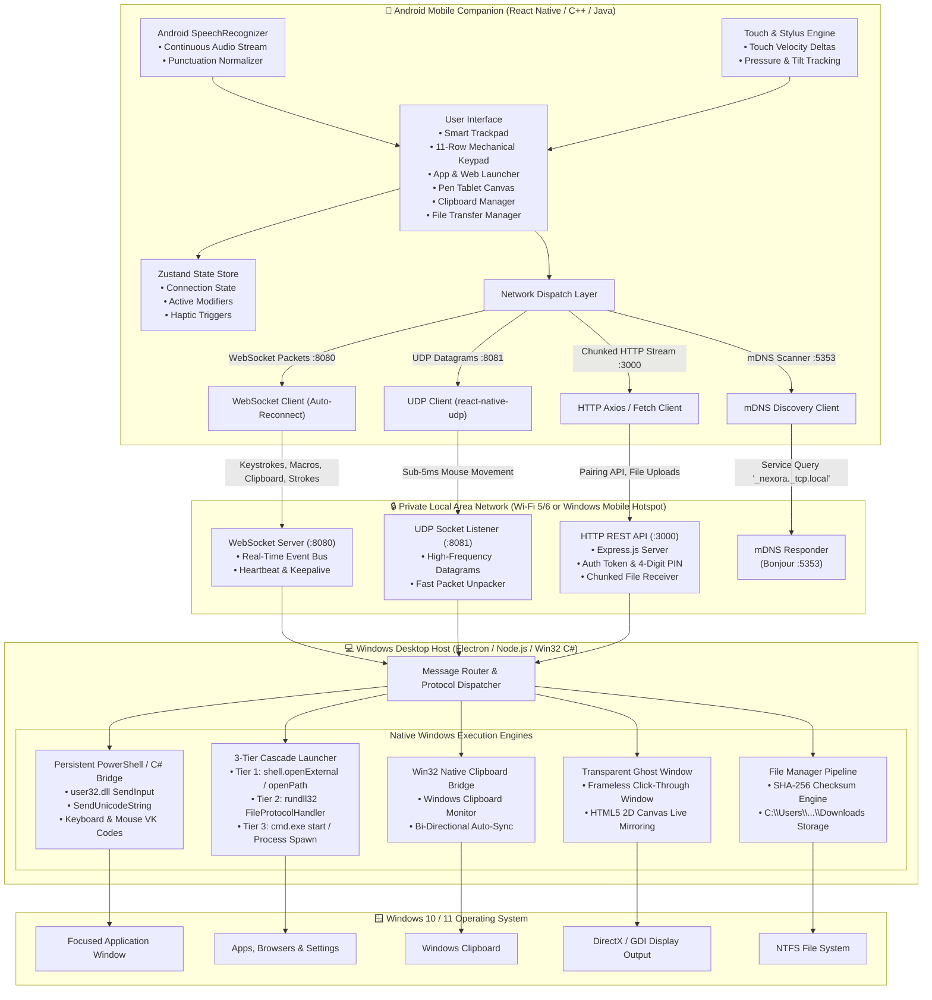
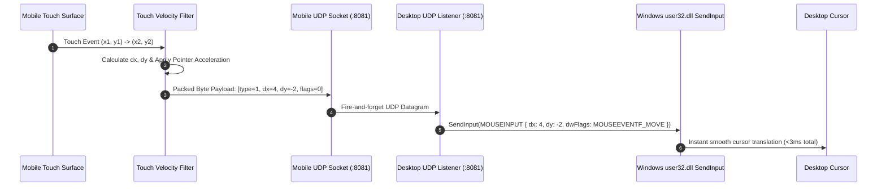
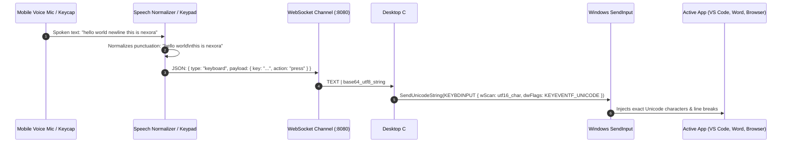
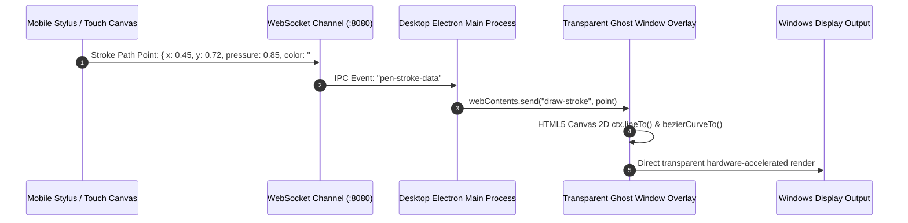

# Nexora Ecosystem Architecture & Technical Specification

[← Back to Main Documentation](../README.md)

This document provides a comprehensive architectural breakdown of the **Nexora Wireless Remote Control Ecosystem**, encompassing the **Windows Desktop Host** (Electron / Node.js native engine) and the **Android Mobile Companion** (React Native / Native C++ / Java modules).

---

## 🏗️ High-Level System Architecture

---

## 🌐 Multi-Protocol Communication Stack

Nexora employs a heterogeneous 4-protocol networking model where each task is mapped to the optimal transport layer:

| Port | Protocol | Layer | Purpose | Rationale |
| :--- | :--- | :--- | :--- | :--- |
| **8081** | **UDP** | Transport | Mouse delta tracking & cursor physics | **<5ms latency**. UDP eliminates TCP head-of-line blocking, connection handshakes, and packet retransmission queues. Out-of-order delta packets are superseded by newer packets. |
| **8080** | **TCP / WebSocket** | Application | Keystrokes, modifiers, macros, live pen tablet vector strokes, clipboard sync | **Guaranteed delivery & ordering**. Keystrokes and macros must never be dropped or arrived out of order. |
| **3000** | **TCP / HTTP REST** | Application | Device pairing, QR code verification, 4-digit PIN auth, file uploads, telemetry | **Stateless request/response**. High-throughput chunked HTTP multipart streaming for file transfers up to 40+ MB/s with SHA-256 validation. |
| **5353** | **UDP / mDNS** | Transport | Multicast DNS Zero-Configuration Discovery (`_nexora._tcp.local`) | **Zero manual configuration**. Allows mobile devices to detect desktop hosts across LAN subnets automatically. |

---

## ⚡ Data Flow & Sequence Workflows

### 1. Ultra-Low Latency Mouse Cursor Streaming (UDP)

---

### 2. Full Unicode Keyboard & Voice Dictation Injection

---

### 3. Ghost Window Live Annotation Pipeline

---

## 🔒 Security & Sandboxing Model

1. **Strict Local Network Isolation**:
   - The desktop host binds to local network interfaces (`0.0.0.0` or private subnets `192.168.x.x`, `10.x.x.x`, `172.16.x.x`).
   - No external WAN port forwarding, STUN/TURN relays, or cloud servers are utilized.
2. **Session Authentication**:
   - Device pairing is authenticated using a dynamic 4-digit security PIN or cryptographic QR verification token.
3. **Memory Safety & Process Isolation**:
   - High-privilege Win32 API calls (`SendInput`, `ShellExecuteEx`) are executed within a dedicated child process bridge with clean boundary checking.
4. **Zero Keystroke Telemetry**:
   - Neither the mobile client nor the desktop server logs, stores, or transmits user input strings outside the active LAN socket session.

---

[← Back to Main Documentation](../README.md)
