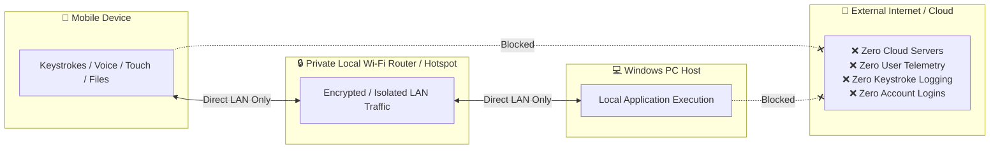

# Security, Privacy & Local LAN Architecture

[← Back to Main Documentation](../README.md)

At Nexora, user privacy and data security are foundational design principles. Nexora is architected from the ground up to operate **100% locally on your private network**, without cloud dependencies, external relays, analytics tracking, or remote telemetry.

---

## 🛡️ Core Security Principles



---

## 1. Zero Cloud Intermediaries

- **No Remote Servers**: Nexora does not route your mouse movements, keystrokes, clipboard text, or files through any cloud server, third-party intermediary, or relay proxy.
- **No User Accounts or Registration**: You never need an account, email address, password, or profile to use Nexora.
- **Air-Gapped & Offline Ready**: Nexora functions seamlessly on offline local networks or Windows Mobile Hotspots without an active internet connection.

---

## 2. Authentication & Session Security

- **4-Digit Security PIN**: The Windows host generates a dynamic 4-digit PIN displayed on the desktop dashboard. Mobile clients must provide this PIN to establish a paired connection.
- **Cryptographic QR Code Verification**: The pairing QR code encodes the exact local IP, port, and temporary session token, eliminating manual misconfiguration and preventing unauthorized devices from connecting.
- **Explicit Connection Approval**: Unauthorized incoming connection requests are rejected by default.

---

## 3. Data Ingestion & Memory Isolation

- **Zero Keystroke Persistence**: Keystroke payloads sent via the Mechanical Keyboard or Speech Dictation engine are piped directly into the active Windows application using the native `SendUnicodeString` / `SendInput` APIs. They are never written to disk, cached, or logged.
- **Volatile In-Memory Clipboard**: Clipboard synchronization occurs in-memory via WebSocket events. The optional history log is maintained strictly within local storage on your device and can be cleared with a single tap.
- **File Integrity Verification**: All file transfers over Wi-Fi include a cryptographically computed **SHA-256 checksum** to verify that transferred files have not been corrupted or tampered with in transit.

---

## 4. Windows Firewall & Network Sandboxing

Nexora configures strict inbound firewall rules on Windows to allow only necessary local LAN traffic:

```powershell
# Inbound local firewall rules created by Nexora
netsh advfirewall firewall add rule name="Nexora WebSocket (8080)" dir=in action=allow protocol=TCP localport=8080
netsh advfirewall firewall add rule name="Nexora HTTP API (3000)" dir=in action=allow protocol=TCP localport=3000
netsh advfirewall firewall add rule name="Nexora UDP Mouse (8081)" dir=in action=allow protocol=UDP localport=8081
```

---

## 5. Security & Privacy Audit Summary

| Parameter | Nexora Policy |
| :--- | :--- |
| **Cloud Telemetry** | **Disabled / None** |
| **Keystroke Logging** | **Disabled / None** |
| **Analytics & Ad Tracking** | **Disabled / None** |
| **User Data Collection** | **Zero Data Collected** |
| **External Network Ports Opened** | **None (LAN Only)** |
| **Open Source Licensing** | **MIT License** |

---

[← Back to Main Documentation](../README.md)
