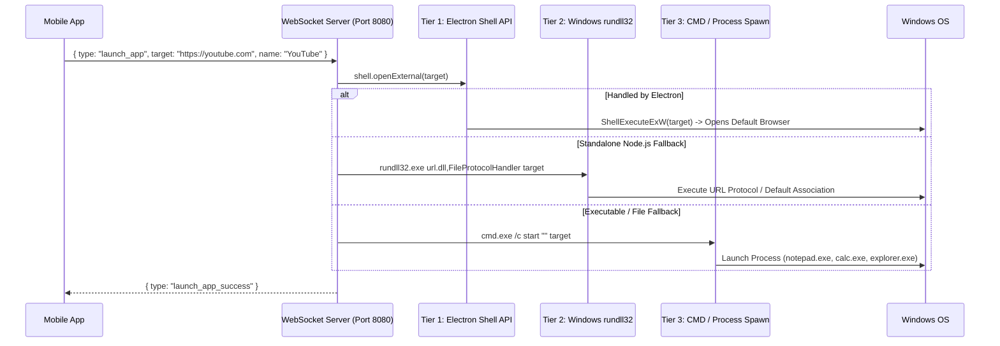

# 🚀 App & Web Launcher Feature

The **App & Web Launcher** allows you to instantly open desktop applications, system settings, folders, and websites on your Windows PC with a single tap from your mobile phone.

---

## 🛠️ How It Works

---

## 💻 3-Tier Multi-Execution Engine

To ensure 100% reliability regardless of whether Nexora runs inside the Electron desktop client or standalone Node.js, a 3-tier execution cascade is utilized:

1. **Tier 1 (Direct Electron Shell API)**:
   - Uses `shell.openExternal(target)` for web URLs (`https://...`) and system protocols (`ms-settings:`, `calc:`, `spotify:`, `discord:`).
   - Uses `shell.openPath(target)` for local paths and directories.
   - Leverages native Windows `ShellExecuteExW` APIs with 0 delay.
2. **Tier 2 (Windows `rundll32.exe url.dll,FileProtocolHandler`)**:
   - Built-in Windows protocol handler that reliably opens any URL without terminal popups or quoting issues.
3. **Tier 3 (Windows `cmd.exe /c start` & Native Spawn)**:
   - Spawns desktop executables (`notepad.exe`, `calc.exe`, `explorer.exe`, `code`, `cmd.exe`, `powershell.exe`) in the active user desktop session.

---

## 📦 Preset Catalog

Nexora comes preloaded with 50+ popular web apps, dev tools, and Windows system utilities:

### 🌐 Web & Social
- **YouTube**, **ChatGPT**, **Google Search**, **GitHub**, **Reddit**, **Twitter / X**, **Instagram**, **LinkedIn**, **Netflix**, **Twitch**, **Amazon**, **Wikipedia**, etc.

### ⚙️ Windows System & Personalisation
- **Personalisation**: Direct shortcut to Windows themes, wallpapers, colors, and lock screen (`ms-settings:personalization`).
- **PC Settings**: Windows main settings hub (`ms-settings:`).
- **Display Settings**: Resolution, scaling, and monitor layout (`ms-settings:display`).
- **Sound Settings**: Volume, output devices, and audio configuration (`ms-settings:sound`).
- **Bluetooth & Devices**: Connected Bluetooth devices & printers (`ms-settings:bluetooth`).
- **Windows Update**: Check for updates (`ms-settings:windowsupdate`).
- **Installed Apps**: Manage installed programs (`ms-settings:appsfeatures`).
- **File Explorer**: Browse files & drives (`explorer.exe`).
- **Downloads Folder**: Direct shortcut to PC Downloads (`shell:Downloads`).
- **Documents Folder**: Direct shortcut to PC Documents (`shell:Personal`).
- **Control Panel**: Classic Windows Control Panel (`control.exe`).
- **Task Manager**: Performance monitor & running tasks (`taskmgr.exe`).
- **Device Manager**: Hardware devices & drivers (`devmgmt.msc`).
- **Resource Monitor**: CPU, RAM, and Disk monitoring (`resmon.exe`).

---

## 🎨 Full Customization & CRUD

- **Add Custom App / Web**: Tap **Add App** to create any custom launcher item.
- **Icon Selector**: Choose from 60+ categorized vector icons (browsers, social, gaming, media, development, system).
- **Color Themes**: Select from vibrant accent colors.
- **Favorites & Filtering**: Filter by categories (`All`, `Favorites`, `Web`, `System`, `Dev`, `Media`, `Social`, `Gaming`) or search by name.
- **Smart Preset Merge**: Newly released system presets automatically appear without needing to reset or delete custom apps.
