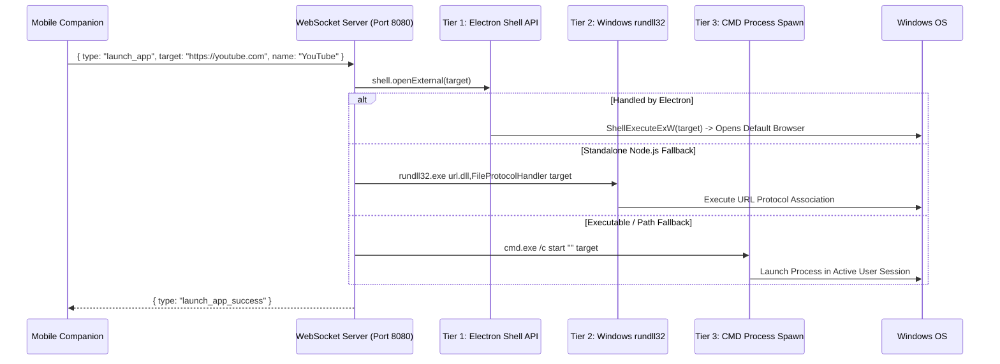

# One-Tap App & Web Launcher

[← Back to Main Documentation](../README.md)

The **App & Web Launcher** enables instant launching of desktop applications, system settings, directories, and web applications on your Windows PC with a single tap from your mobile device.

---

## Architecture Overview

---

## 3-Tier Multi-Execution Engine

To guarantee 100% execution reliability regardless of host deployment mode (packaged Electron desktop app or standalone background service), Nexora employs a 3-tier cascade:

1. **Tier 1: Direct Electron Shell API**
   - Invokes `shell.openExternal(target)` for web URLs (`https://...`) and URI protocol handlers (`ms-settings:`, `calc:`, `spotify:`, `discord:`).
   - Invokes `shell.openPath(target)` for local directories and file paths.
   - Utilizes Windows native `ShellExecuteExW` APIs with zero spawn latency.

2. **Tier 2: Windows `rundll32.exe url.dll,FileProtocolHandler`**
   - Built-in Windows protocol handler that reliably dispatches any URL to the user's default browser without spawning command terminal popups.

3. **Tier 3: Windows `cmd.exe /c start` & Native Process Spawn**
   - Executes desktop binaries (`notepad.exe`, `calc.exe`, `explorer.exe`, `code`, `wt.exe`) directly in the active interactive desktop session.

---

## Preset Catalog

Nexora comes preloaded with 50+ popular web services, developer tools, and Windows system utilities:

### Web & Social
- **Productivity & Dev**: YouTube, ChatGPT, GitHub, Stack Overflow, Google Search, Wikipedia, Reddit, LinkedIn, Twitter / X, Notion, Figma
- **Entertainment & Media**: Netflix, Spotify, Twitch, Amazon Prime, Disney+, SoundCloud, YouTube Music

### Windows System & Personalisation
- **Personalisation Hub**: Direct shortcut to Windows themes, wallpapers, colors, and lock screen (`ms-settings:personalization`).
- **Settings & Network**: Main Windows Settings (`ms-settings:`), Network & Internet (`ms-settings:network`), Wi-Fi Settings (`ms-settings:network-wifi`).
- **Display & Audio**: Display Resolution & Multi-Monitor (`ms-settings:display`), Sound & Volume Mixer (`ms-settings:sound`).
- **Core Utilities**: Windows File Explorer (`explorer.exe`), Downloads folder, Task Manager (`taskmgr.exe`), Calculator (`calc.exe`), Command Prompt (`cmd.exe`), PowerShell (`powershell.exe`).

---

## Custom Shortcut Creation

You can add unlimited custom shortcuts directly from the mobile app:
1. Tap **Add Shortcut** (+) in the Launcher tab.
2. Enter a **Name** and the **Target URL / Path** (e.g., `https://my-internal-tool.com` or `C:\Games\Game.exe`).
3. Select an icon from 60+ vector options and choose a custom accent color.
4. Tap **Save** — the shortcut is instantly saved to your local device storage.

---

[← Back to Main Documentation](../README.md)
