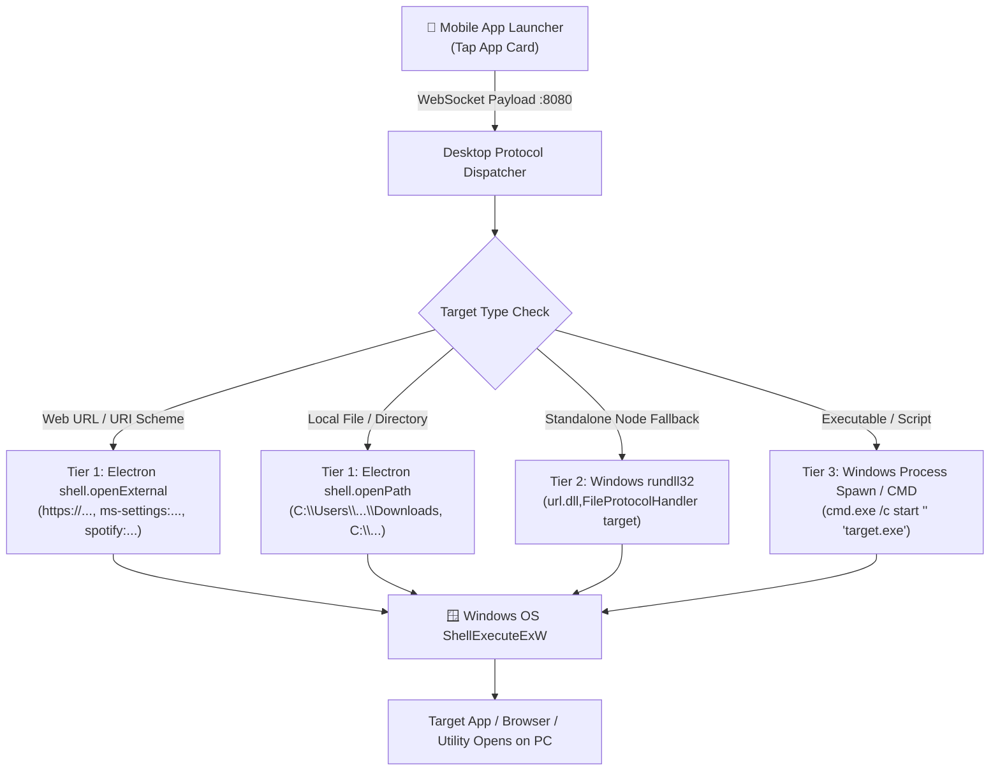

# One-Tap App, Web & System Launcher

[← Back to Main Documentation](../README.md)

The **App & Web Launcher** enables instant single-tap execution of desktop applications, web services, Windows settings, local directories, and terminal scripts on your Windows PC directly from your Android mobile device.

---

## 🏗️ Architecture & 3-Tier Multi-Execution Engine

To guarantee 100% execution reliability across both packaged Electron desktop environments and background daemon server modes, Nexora employs a 3-tier cascade execution engine:

### Execution Tier Breakdown

1. **Tier 1: Native Electron Shell API**
   - Dispatches web URLs (`https://youtube.com`, `https://github.com`) and custom URI protocol schemes (`ms-settings:`, `spotify:`, `discord:`, `calc:`) via `shell.openExternal(target)`.
   - Opens local directories (`C:\Users\<User>\Downloads`, `explorer.exe`) via `shell.openPath(target)`.
   - Bypasses terminal popup windows entirely.
2. **Tier 2: Windows `rundll32.exe url.dll,FileProtocolHandler`**
   - Native Windows fallback that dispatches any valid URL or URI scheme directly to the user's default browser or registered handler.
3. **Tier 3: Native Process Spawner (`cmd.exe /c start` / `child_process.spawn`)**
   - Spawns desktop executables (`notepad.exe`, `taskmgr.exe`, `wt.exe`, `code.cmd`) in the interactive user desktop session.

---

## 📂 Comprehensive Built-in Preset Catalog

Nexora comes seeded with over 50 curated desktop programs, developer tools, entertainment portals, and Windows system configurations:

### 1. Web & Search
- **Google Search**: `https://google.com`
- **ChatGPT**: `https://chatgpt.com`
- **Claude AI**: `https://claude.ai`
- **Wikipedia**: `https://wikipedia.org`
- **Bing Search**: `https://bing.com`

### 2. Social & Communication
- **WhatsApp Web**: `https://web.whatsapp.com`
- **Discord**: `https://discord.com/app` / `discord:`
- **Reddit**: `https://reddit.com`
- **Twitter / X**: `https://x.com`
- **LinkedIn**: `https://linkedin.com`
- **Instagram**: `https://instagram.com`
- **Telegram Web**: `https://web.telegram.org`

### 3. Productivity & Work
- **Notion**: `https://notion.so`
- **Google Docs**: `https://docs.google.com`
- **Google Sheets**: `https://sheets.google.com`
- **Google Drive**: `https://drive.google.com`
- **Figma**: `https://figma.com`
- **Slack**: `https://slack.com`
- **Trello**: `https://trello.com`

### 4. Media & Entertainment
- **YouTube**: `https://youtube.com`
- **Spotify**: `spotify:` / `https://open.spotify.com`
- **Netflix**: `https://netflix.com`
- **Twitch**: `https://twitch.tv`
- **YouTube Music**: `https://music.youtube.com`
- **Amazon Prime Video**: `https://primevideo.com`
- **SoundCloud**: `https://soundcloud.com`

### 5. Developer & Terminal Tools
- **VS Code**: `code` / `code.cmd`
- **Windows Terminal**: `wt.exe`
- **Command Prompt (CMD)**: `cmd.exe`
- **PowerShell**: `powershell.exe`
- **GitHub**: `https://github.com`
- **Stack Overflow**: `https://stackoverflow.com`

### 6. Windows System & Personalisation Hub
- **File Explorer**: `explorer.exe`
- **Downloads Folder**: `shell:Downloads`
- **Documents Folder**: `shell:Personal`
- **Task Manager**: `taskmgr.exe`
- **Calculator**: `calc.exe`
- **Notepad**: `notepad.exe`
- **Snipping Tool**: `snippingtool.exe`
- **Control Panel**: `control.exe`
- **Device Manager**: `devmgmt.msc`
- **Windows Settings**: `ms-settings:`
- **Personalisation & Themes**: `ms-settings:personalization`
- **Sound & Volume Mixer**: `ms-settings:sound`
- **Display & Monitors**: `ms-settings:display`
- **Bluetooth & Devices**: `ms-settings:bluetooth`
- **Network & Wi-Fi**: `ms-settings:network`

---

## ⭐ Starred Favorites & Keyboard Synchronization

- **1-Tap Pinning**: Tap the star (`★`) icon on any app card in the Launch App tab.
- **Priority Sorting**: Starred apps are automatically promoted to the front of the launcher grid.
- **Bi-Directional Keypad Sync**: Starred items are automatically mirrored onto the **Quick Launch Bar on the Mechanical Keyboard screen**, allowing instant execution while typing.

---

## 🛠️ Adding Custom Applications & Commands

You can add unlimited custom items from the mobile app:
1. Tap **+ Add App** in the top header.
2. Configure the following fields:
   - **App Name**: The label displayed on the mobile card.
   - **Category**: Web, Social, Productivity, Media, Dev & Tools, System, Gaming, or Custom.
   - **Command / Path / URL**:
     - *Web URL*: `https://my-internal-tool.com`
     - *Installed Application*: `C:\Program Files\Blender Foundation\Blender 4.0\blender.exe`
     - *URI Protocol Scheme*: `steam://rungameid/730` (CS:GO / Steam games)
     - *Interactive Script*: `powershell.exe -NoExit -Command "docker ps"`
   - **Icon & Color**: Select from 60+ logos / vector icons and 12 curated theme colors.
3. Tap **Save App** — stored locally in your mobile configuration.

---

[← Back to Main Documentation](../README.md)
