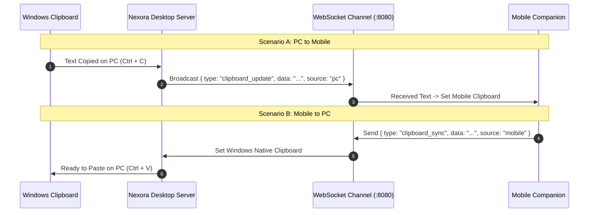

# Bi-Directional Clipboard Synchronization

[← Back to Main Documentation](../README.md)

Nexora enables real-time clipboard text synchronization between your Windows PC and mobile phone with zero-click background automation.

---

## Synchronization Flow

---

## Key Capabilities

### 1. Zero-Click Auto-Sync
- Whenever you copy text on your computer (`Ctrl + C`), Nexora automatically pushes the string to your phone.
- Text copied on your mobile device is instantly registered in your PC clipboard for immediate `Ctrl + V` pasting.

### 2. Searchable Clipboard History
- View a timestamped chronological log of recent clips from both your computer and phone.
- Filter and search through previous clipboard entries.
- One-tap buttons to copy any historic snippet to your local clipboard or re-send to your mobile device.

### 3. Local LAN Privacy
- All clipboard text is transmitted strictly over your private local Wi-Fi router.
- No cloud relays, third-party servers, or external databases are involved.

---

[← Back to Main Documentation](../README.md)
