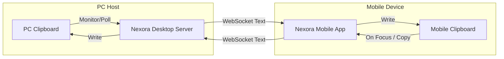

# 📋 Bidirectional Clipboard Sync Feature

The **Clipboard Sync** feature connects your phone and your PC's clipboard. Any text you copy on your phone can be immediately pasted on your PC, and vice versa.

---

## 🛠️ How It Works

Clipboard synchronization runs automatically in the background as long as a mobile client is actively connected.



### 1. Monitoring PC-to-Mobile Clipboard
The Nexora Desktop server polls the system clipboard at regular intervals (usually every 1.5 seconds) using local shell calls:
- If it detects a change in the clipboard content (and the active owner is not the WebSocket client itself), it packages the text.
- The text is transmitted via a WebSocket payload:
  ```json
  {
    "type": "clipboard_sync",
    "text": "Copied content from PC"
  }
  ```
- The mobile application receives the payload and writes it directly to the mobile device's system clipboard using React Native's Clipboard API.

### 2. Monitoring Mobile-to-PC Clipboard
- When the mobile app is open and detects clipboard changes, or when the user manually taps the "Sync Clipboard" button, the text is sent via WebSockets.
- The PC server receives the payload and sets the system clipboard.

---

## 🔒 Security & Performance Considerations

- **Local Network Isolation**: Your copied data is sent directly between the phone and the PC over the local network (no third-party cloud server is involved).
- **Text Only**: Clipboard sync only supports plain text. Images, formatted rich-text, and file paths are ignored to prevent performance issues and excessive memory usage.
- **Auto-Pause on Idle**: If no devices are connected, clipboard polling halts automatically to conserve system resources.
- **Sensitive Data Warning**: We recommend disabling clipboard sync inside the settings when copying highly sensitive items (e.g., master passwords or credit card numbers) to avoid unintended broadcast across your local devices.
