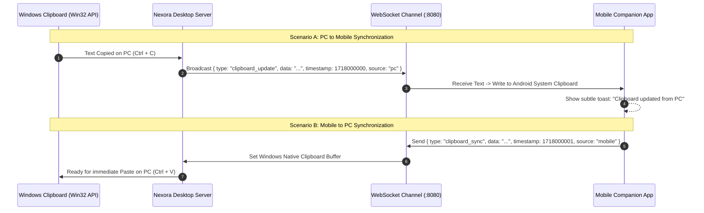

# Bi-Directional Clipboard Synchronization

[← Back to Main Documentation](../README.md)

Nexora delivers instant bi-directional clipboard text synchronization between your Windows PC and mobile phone with zero-click background automation over your private local Wi-Fi network.

---

## 🔄 Synchronization Flow & Architecture

---

## 🌟 Key Capabilities

### 1. Zero-Click Background Auto-Sync
- **Copy on PC → Ready on Phone**: Whenever you copy text on your computer (`Ctrl + C`), Nexora pushes the string directly to your phone's clipboard.
- **Copy on Phone → Ready on PC**: Text copied on your mobile device is registered into your PC clipboard for instant `Ctrl + V` pasting into your active desktop application.

### 2. Searchable Clipboard History Log
- View a timestamped chronological log of recent clipboard clips from both your computer and phone.
- Filter and search through previous clipboard entries.
- One-tap buttons to copy any historic snippet to your local clipboard or re-push it to your connected device.

### 3. Complete LAN Privacy
- All clipboard payloads are transmitted strictly over your private local Wi-Fi network via WebSocket.
- No cloud relays, external logging databases, or analytics servers are involved.

---

[← Back to Main Documentation](../README.md)
