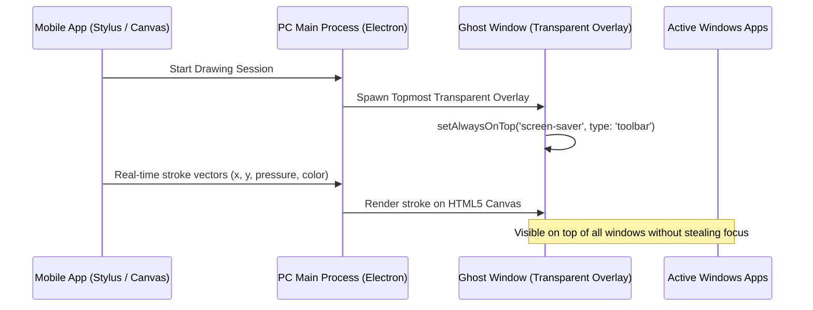

# 🎨 Pen Tablet & Screen Annotation Feature

The **Pen Tablet & Screen Annotation** feature turns your mobile device into a graphics drawing tablet. It allows you to draw annotations live on top of your Windows desktop, annotate presentations, and markup documents in real time.

---

## 🛠️ How It Works

---

## 🖥️ Persistent Ghost Window Overlay Architecture

In previous builds, switching active application windows on Windows could cause the drawing overlay to hide or lose z-index stacking. In the latest build:
1. **Window Flags**:
   - `type: 'toolbar'` and `focusable: false` prevent Windows from stealing focus from underlying presentation tools or games.
   - `alwaysOnTop: true` with `'screen-saver'` tier guarantees the overlay remains visible over full-screen browser tabs and PowerPoint slideshows.
2. **Click-Through Mode**:
   - When enabled, mouse events pass directly through the drawing canvas to underlying applications (`setIgnoreMouseEvents(true, { forward: true })`).

---

## 🖌️ Drawing Capabilities & Tools

| Tool | Capabilities |
| :--- | :--- |
| **Stylus & Pen** | Pressure simulation, multi-color palette (Neon, Dark, Classic), and variable stroke width (1px to 40px). |
| **Highlighter** | Semi-transparent highlighter brush for documents and code reviews. |
| **Eraser & Clear** | Point eraser and 1-tap **Clear All Canvas** button. |
| **Grid & Guide Mode** | Optional background grid on mobile for precise sketching and technical diagrams. |
| **PDF & PNG Export** | 1-Tap export to save your full screen annotations directly as high-resolution PNG or annotated PDF in your PC's `Downloads` folder. |

---

## ❓ FAQ & Troubleshooting

### Why is the overlay not showing when switching windows?
- Update to the latest Nexora Desktop release. The new topmost enforcement loop maintains overlay visibility regardless of which Windows app is focused.

### Coordinates are offset on multi-monitor setups
- Ensure monitor scaling in Windows Display Settings is consistent (e.g. 100% or 125% across connected monitors).
