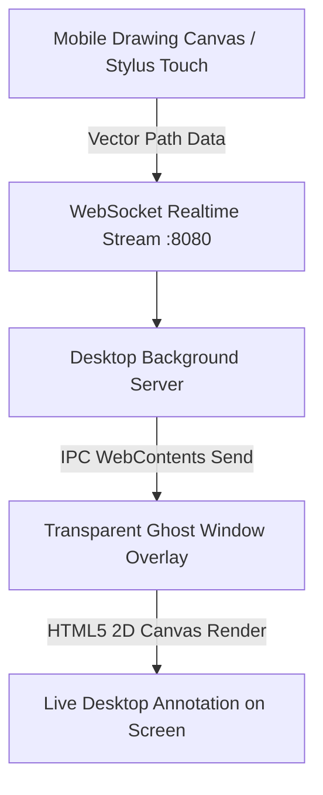

# Interactive Pen Tablet & Screen Annotation

[← Back to Main Documentation](../README.md)

Nexora transforms your touchscreen smartphone into a wireless drawing tablet, mirroring annotations live onto a transparent fullscreen Windows Ghost Window overlay.

---

## Live Drawing Architecture

---

## Key Features

### 1. Transparent Ghost Window Overlay
- Nexora creates a borderless, always-on-top, click-through transparent Windows desktop window.
- Drawing strokes made on your mobile device appear instantaneously across your active PC workspace without obscuring open applications.

### 2. Stylus & Touch Controls
- **Pressure Simulation**: Simulated stroke width modulation based on finger velocity and stylus pressure.
- **Palette & Brushes**: Customizable brush widths, eraser mode, undo/redo stack, and vibrant color presets.
- **Grid Modes**: Switch between blank, lined note, and isometric grid backgrounds on mobile for precise sketching.

### 3. Document Export
- Export your mobile sketches and marked-up annotations directly into high-resolution **PNG** images or formatted **PDF** documents with one tap.

---

[← Back to Main Documentation](../README.md)
