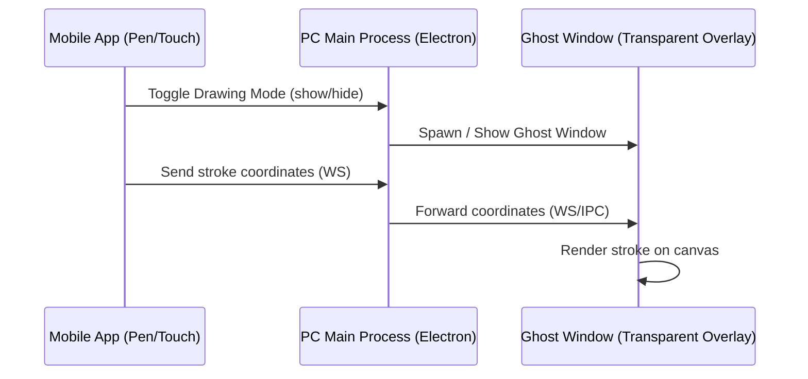

# 🎨 Pen Tablet & Drawing Annotation Feature

The **Pen Tablet & Drawing Annotation** feature turns your mobile device into a graphics drawing tablet. It allows you to draw annotations directly onto your PC screen or markup PDF documents in real time.

---

## 🛠️ How It Works

This feature utilizes a transparent overlay window in Electron (known as the "Ghost Window") that spans all active displays.



### 1. The Ghost Window Overlay
In `main.cjs`, when drawing mode is toggled, Electron creates a click-through, frameless, transparent window covering the entire screen dimensions of all connected monitors:
```javascript
ghostWindow = new BrowserWindow({
  x: minX, y: minY,
  width: maxWidth - minX,
  height: maxHeight - minY,
  transparent: true,
  frame: false,
  alwaysOnTop: true,
  hasShadow: false,
  ...
});
ghostWindow.setIgnoreMouseEvents(true, { forward: true }); // Click-through enabled
```
This lets you see and draw on top of active applications (like PowerPoint, websites, or CAD software) without blocking clicks to the underlying applications.

### 2. Stroke and Coordinate Sync
- Touch inputs are recorded on the mobile screen using pressure-sensitive canvas tracking.
- Coordinates are scaled to fit the host monitor bounds and sent via WebSockets:
  ```json
  {
    "type": "draw_stroke",
    "points": [{ "x": 100, "y": 150 }, { "x": 105, "y": 155 }],
    "color": "#ff0000",
    "width": 4,
    "tool": "pen"
  }
  ```
- The main process forwards these events to the Ghost Window renderer, which draws them onto an HTML5 Canvas overlay.

---

## 🚀 Drawing Features & Tools

### 1. Annotation Canvas Controls
- **Pen & Highlighter Tools**: Select colors, opacity, and brush sizes. Draw arrows, underline, or highlight key points during presentations.
- **Eraser Tool**: Erase specific drawn lines or click "Clear All" to wipe the canvas clean.
- **Undo / Redo**: Standard drawing history management.
- **Click-Through Mode Toggle**: Pause drawing to click and scroll on underlying apps, then toggle it back on to continue annotating.

### 2. PDF Annotation (Advanced Markup)
You can open a PDF file on your PC and markup pages directly from your phone:
- **Image Insertion**: Embed images from your mobile gallery directly into the PDF.
- **Text Insertion**: Type notes on your phone and position them on the PDF page.
- **Save Annotated PDF**: Once finished, the main process runs `pdf-lib` to merge your hand-drawn lines, text elements, and images directly into the original PDF file, saving a new copy in your Downloads.

---

## ❓ FAQ & Troubleshooting

### My drawings are misaligned or shifted
- If you are using multiple monitors, make sure they are aligned correctly in Windows Display Settings. The Ghost Window stretches across all bounds, and display scaling (e.g. 125% vs 100%) can occasionally throw off coordinates. Try setting display scaling to 100% on both screens.

### How do I save my screen drawings?
- Tap the **Save Canvas** button on your mobile app screen. The desktop app will open a "Save File" dialog on your PC to export your drawing as a PNG image.
