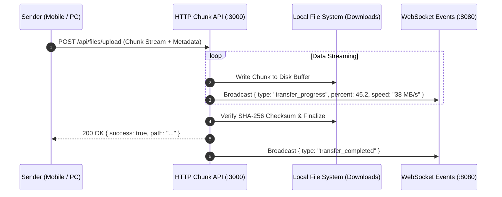

# High-Speed Wireless File Transfer

[← Back to Main Documentation](../README.md)

Nexora includes an ultra-fast wireless local file transfer pipeline, allowing you to transfer photos, 4K videos, documents, and archives between PC and mobile at speeds up to 40+ MB/s.

---

## Transfer Pipeline

---

## Technical Specifications

| Parameter | Specification |
| :--- | :--- |
| **Transfer Protocol** | Chunked HTTP Streaming / REST API |
| **Integrity Verification** | SHA-256 Checksum Validation per transfer |
| **Average Transfer Speed** | 30 MB/s – 45 MB/s (Wi-Fi 5 / 6) |
| **Maximum File Size** | No artificial limit (tested up to 20 GB files) |
| **Default PC Storage Path** | `C:\Users\<User>\Downloads\Nexora Transferred Files` |

---

## Features

### 1. Real-Time Transfer Telemetry
- Active progress bar showing percentage completion.
- Real-time speedometer (MB/s) and bytes transferred counter.
- Directional indicators for incoming (`📥`) vs outgoing (`📤`) transfers.

### 2. Received Files Explorer
- Browse transferred files directly inside the desktop dashboard.
- 1-click actions to open files with default Windows applications or reveal them in Windows File Explorer.

---

[← Back to Main Documentation](../README.md)
