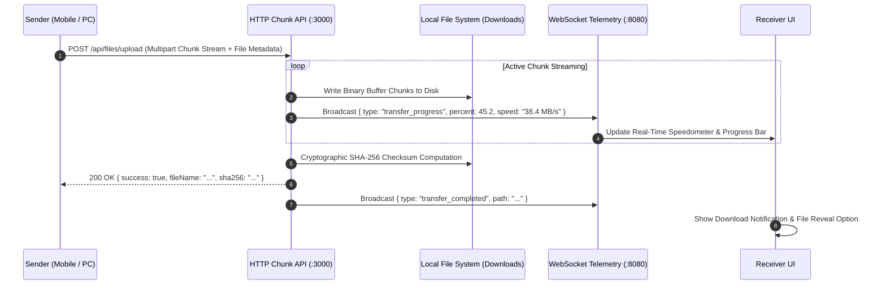

# High-Speed Wireless File Transfer Engine

[← Back to Main Documentation](../README.md)

Nexora includes an ultra-fast wireless local file transfer pipeline, allowing you to transfer photos, 4K videos, documents, and large ZIP archives between PC and mobile at speeds up to **40+ MB/s** over your local Wi-Fi network.

---

## ⚡ Transfer Pipeline Architecture

---

## 📊 Technical Specifications

| Parameter | Specification | Notes |
| :--- | :--- | :--- |
| **Transfer Protocol** | Chunked Multipart HTTP Streaming / REST API (:3000) | Maximizes local network bandwidth |
| **Average Transfer Speed** | **30 MB/s – 45+ MB/s** (Wi-Fi 5 / 6) | Zero internet data usage |
| **Integrity Verification** | **SHA-256 Checksum Validation** per transfer | Guarantees byte-for-byte fidelity |
| **Maximum File Size** | **Unlimited** (Tested with 20+ GB ISO files) | Streams in memory-safe buffers |
| **Default PC Destination** | `C:\Users\<User>\Downloads\Nexora Transferred Files` | Organized with timestamp metadata |

---

## 🌟 Key Capabilities

### 1. Real-Time Telemetry & Speedometer
- **Live Transfer Metrics**: Displays transfer speed in real time (`MB/s`), total elapsed time, percentage complete, and transferred vs total bytes.
- **Directional Queue**: Distinct status tracking for incoming (`📥`) vs outgoing (`📤`) transfer queues.

### 2. Built-in Received Files Explorer
- Browse transferred files directly inside the desktop dashboard.
- 1-click **Open File** (launches with default Windows viewer) or **Show in Explorer** (reveals file highlighted in Windows File Explorer).

### 3. Pause, Resume & Cancel Controls
- Seamlessly pause and resume large transfers without starting over from scratch.

---

[← Back to Main Documentation](../README.md)
