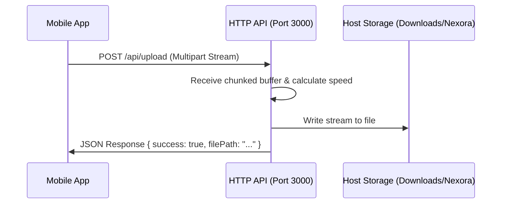

# 📁 High-Speed File Transfer Feature

The **File Transfer** feature allows you to send files (photos, videos, documents, zip archives) from your mobile device to your PC's Downloads folder.

---

## 🛠️ How It Works

Nexora runs an HTTP API server on your PC (port 3000) to receive and process file upload streams.

### 1. HTTP Endpoint Routing
- **Upload Route**: `POST http://YOUR_PC_IP:3000/api/upload`
  - Uploads are sent as standard multipart/form-data POST streams. This allows the client to send massive files chunk-by-chunk without overloading the PC's RAM.
- **File Retrieval Route**: `GET http://YOUR_PC_IP:3000/api/files`
  - Returns a list of all files previously received and stored.
- **Open File Route**: `POST http://YOUR_PC_IP:3000/api/files/open`
  - Opens the selected file on the host PC using the default Windows application (e.g. photos in Windows Photos, PDFs in Acrobat).

### 2. Destination Storage Path
All received files are stored in a dedicated folder under the user's Downloads directory:
`C:\Users\YOUR_USERNAME\Downloads\Nexora\`

If this folder does not exist, the Nexora Desktop server creates it automatically during startup.

---

## 🚀 Advanced Capabilities

### 1. Chunked Stream Progress
During file transfer, the desktop app updates the UI with:
- **Download Speed** (MB/s or KB/s)
- **Percentage Completion**
- **Transferred Bytes / Total Bytes**
This is achieved by tracking chunk bytes as they write to disk and forwarding the stats via WebSockets in real time.

### 2. File Queue Management
The **File Transfers** tab shows:
- **Active Transfers**: Files currently uploading with speed and progress bars.
- **Completed Transfers**: Historic list of files received during the current session, with buttons to "Open File" or "Show in Folder".

---

## ❓ FAQ & Troubleshooting

### Where do I find the files?
- They are saved to `Downloads/Nexora`. You can click the **Open Received Files** button in the dashboard or tray icon to open this folder immediately.

### File transfer fails or halts halfway
- Ensure both devices have a stable connection. Large transfers can timeout on weak networks.
- Check if your PC has enough disk space.
- Verify that Windows Firewall is not blocking port `3000` (this is the API port; WebSocket runs on `8080`).
