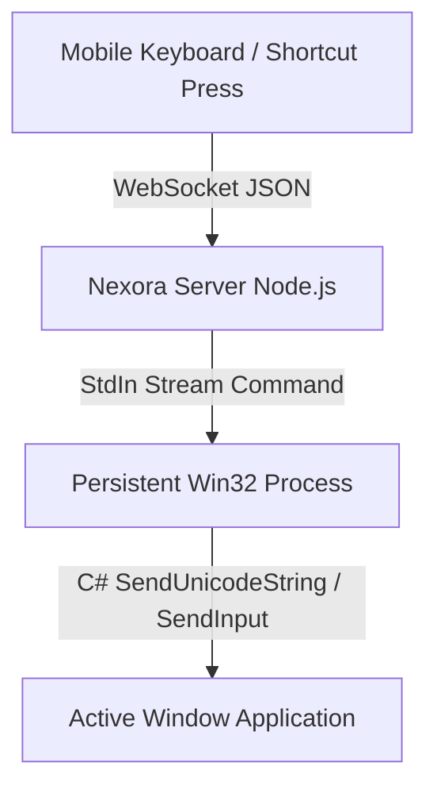

# ⌨️ Real-Time Keyboard & Media Control Feature

The **Keyboard Input & Media Control** feature allows you to type into any application on your Windows PC using your mobile device's virtual keyboard, with full emoji support, holdable modifiers, dedicated media playback controls, browser navigation, and Windows shortcuts.

---

## 🛠️ How It Works

### 1. Persistent Process with C# `SendInput` Engine
- A persistent background PowerShell process is initialized at desktop startup with compiled inline C# classes (`KeyboardControl`).
- Keystrokes are transmitted via `stdin` pipes, resulting in **sub-millisecond (<1ms) execution latency** without spawning child processes per keystroke.

### 2. Full Unicode & Emoji Injection (`KEYEVENTF_UNICODE`)
- Standard Win32 virtual keycodes only support standard ASCII characters, which previously caused emojis to type as `?`.
- Nexora implements **C# `SendUnicodeString`** using `KEYEVENTF_UNICODE (0x0004)` flags with UTF-16 surrogate pair handling.
- When you type emojis (😀🔥🚀⚡) or non-Latin characters from your mobile keyboard, they are injected natively into the active PC text buffer.

---

## 🎮 Extended Control Panels

### 1. Media & Volume Playback
- **Play / Pause**: Virtual key `0xB3` (`VK_MEDIA_PLAY_PAUSE`)
- **Next Track / Previous Track**: Virtual keys `0xB0` / `0xB1`
- **Stop**: Virtual key `0xB2`
- **Mute / Unmute**: Virtual key `0xAD` (`VK_VOLUME_MUTE`)
- **Volume Down / Volume Up**: Virtual keys `0xAE` / `0xAF`

### 2. Browser & Document Navigation
- **Browser Back / Forward**: Virtual keys `0xA6` / `0xA7`
- **Refresh (F5)**: Virtual key `0x74`
- **Page Up / Page Down**: Virtual keys `0x21` / `0x22`
- **Home / End**: Virtual keys `0x24` / `0x23`

### 3. PC Shortcuts & System Utilities
- **Screen Snipping**: `Win + Shift + S` (instant Windows snip tool)
- **PrintScreen (`PrtSc`)**: Virtual key `0x2C`
- **Task Manager**: `Ctrl + Shift + Esc`
- **Lock PC**: `Win + L`
- **Windows Run**: `Win + R`
- **Function Keys**: F1 through F12

### 4. Holdable Modifiers
- Tap **Ctrl**, **Alt**, **Shift**, or **Win** to hold them active.
- A visual indicator shows held modifiers. Tap again or press **Release All** to release.

---

## ❓ FAQ & Troubleshooting

### Emojis or special characters appear as `?`
- Ensure your Nexora Desktop is updated to version 1.0.4+, which includes the `KEYEVENTF_UNICODE` engine.

### Keystrokes not registering in Admin applications
- When typing into elevated programs (e.g. Task Manager, Registry Editor, Admin PowerShell), launch Nexora Desktop as Administrator.
