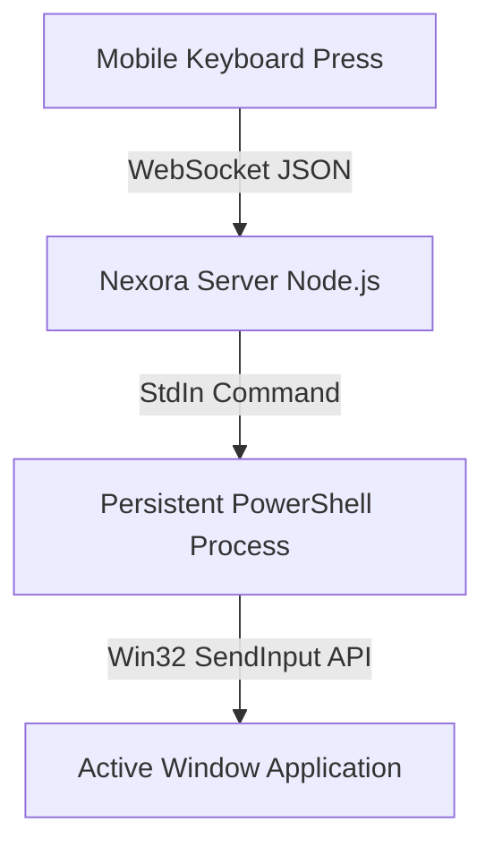

# ⌨️ Real-Time Keyboard Input Feature

The **Keyboard Input** feature allows you to type on your Windows PC using your mobile device's virtual keyboard. It supports standard keys, modifier keys (Ctrl, Alt, Shift, Win), and hotkeys (e.g., Copy/Paste, Undo).

---

## 🛠️ How It Works

To achieve instant keystroke response, Nexora uses a persistent PowerShell process on the host PC to inject keystrokes directly into the Windows OS input stream.



### 1. The Persistent Process Architecture
- **Legacy Approach (v1.0.1)**: Every keypress spawned a new PowerShell instance. This added 200ms–500ms of startup latency per keystroke, rendering typing unusable.
- **Current Optimized Approach (v1.0.2+)**: A single PowerShell process is launched during Nexora's startup. It remains open in the background, listening on standard input (`stdin`) for raw keycodes. When a key is typed on the mobile app, Node sends the keycode to `stdin`, which is immediately executed by the persistent process, resulting in sub-millisecond latency.

### 2. Key Injection Method
PowerShell executes a compiled C# inline assembly wrapper that uses the Win32 `SendInput` API.
Unlike simple `SendKeys` commands (which can be blocked by secure applications or fail in games), `SendInput` operates at the driver level, simulating physical hardware keyboard interrupts.

### 3. Payload Protocol
Keystroke payloads are sent over WebSockets:
```json
{
  "type": "keyboard_input",
  "key": "A",
  "modifiers": ["ctrl", "shift"],
  "keyCode": 65,
  "action": "press"
}
```

---

## 🚀 Key Mappings & Advanced Features

### 1. Text Paste Mode
When typing long paragraphs, the mobile app packages the entire string and sends it as a single chunk. The PowerShell script processes it using a clipboard fallback or character-by-character injection:
```json
{ "type": "keyboard_text", "text": "Hello World from Nexora!" }
```

### 2. Supported Hotkeys & Commands
Nexora intercepts special keycodes to trigger Windows hotkeys:
- **Ctrl + C / Ctrl + V**: Copy & Paste
- **Win + D**: Minimize all windows and show Desktop
- **Alt + Tab**: Toggle active windows
- **Media Keys**: Play/Pause, Volume Up/Down, Mute

---

## ❓ FAQ & Troubleshooting

### Typing is not registering in Administrator windows
- If you are trying to type in an application running with Administrator privileges (like PowerShell, cmd, or Task Manager), Nexora Desktop must also be run as an Administrator.

### Key characters are incorrect (Keyboard Layout Mismatch)
- Nexora maps raw key events. Ensure the active keyboard layout on your PC matches the keyboard layout on your phone (e.g., QWERTY vs. AZERTY).
