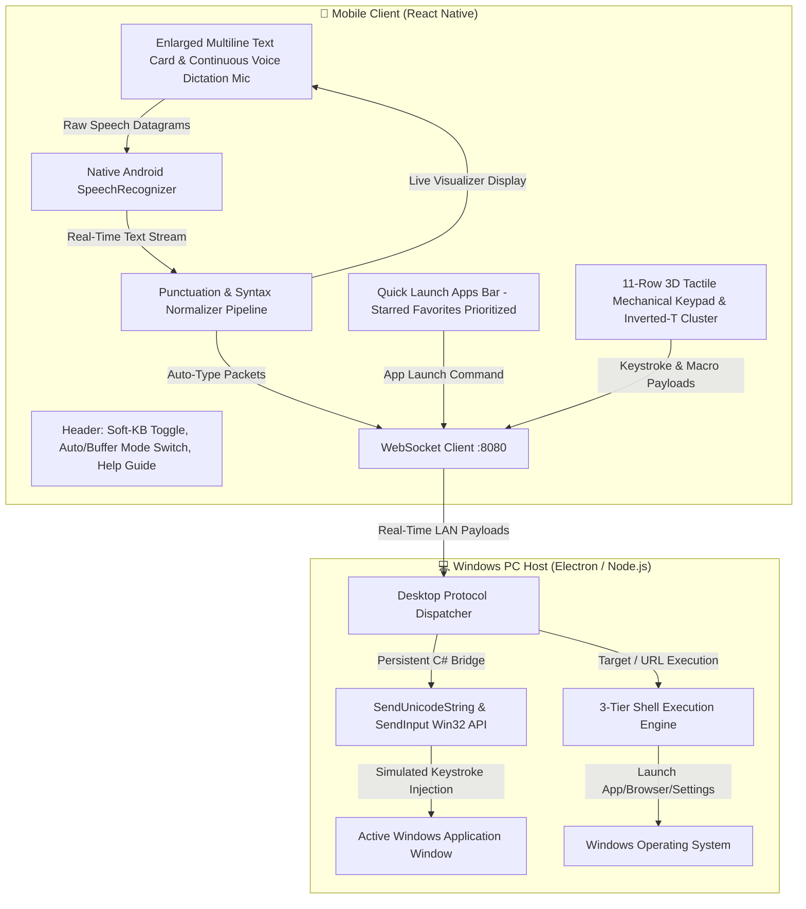
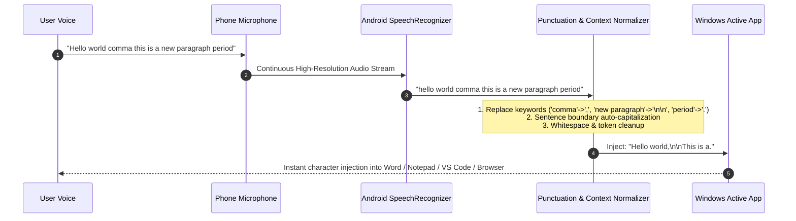

# 11-Row Mechanical PC Remote Keyboard & Speech-to-Text Engine

[← Back to Main Documentation](../README.md)

Nexora transforms your Android smartphone into a high-performance **11-Row 3D Tactile Mechanical Keyboard**, **Quick Launch App Hub**, and **Real-Time Voice Dictation Engine** for Windows PC. Engineered for ultra-low latency wireless typing, full Unicode & Emoji injection, holdable multi-modifier latching, browser automation, desktop macros, and instant app launching.

---

## 🏗️ Technical Architecture



---

## 🎙️ Speech-to-Text Engine & Voice Punctuation Pipeline

The Voice-to-Text engine utilizes continuous speech recognition with on-the-fly punctuation normalization, sentence capitalization, and symbol formatting:



### Complete Voice Punctuation Keyword Table

| Voice Command Keyword | Formatted Symbol / Action | Example Spoken Input | Resulting Formatted Output |
| :--- | :---: | :--- | :--- |
| **"comma"** | `,` | *"Good morning comma team"* | *"Good morning, team"* |
| **"period" / "full stop"** | `.` | *"Project completed period"* | *"Project completed."* |
| **"question mark"** | `?` | *"Are we meeting at three question mark"* | *"Are we meeting at three?"* |
| **"exclamation mark"** | `!` | *"Awesome work exclamation mark"* | *"Awesome work!"* |
| **"new line" / "newline"** | `\n` | *"Header new line subtext"* | *"Header\nsubtext"* |
| **"new paragraph"** | `\n\n` | *"First section new paragraph next section"* | *"First section\n\nNext section"* |
| **"colon"** | `:` | *"Requirements colon internet access"* | *"Requirements: internet access"* |
| **"semicolon"** | `;` | *"Module A semicolon module B"* | *"Module A; module B"* |
| **"open quote" / "close quote"** | `"` | *"He shouted open quote hello close quote"* | *`He shouted "hello"`* |
| **"open paren" / "close paren"** | `(` / `)` | *"Total count open paren five close paren"* | *"Total count (5)"* |
| **"dash" / "hyphen"** | `-` | *"Self dash explanatory"* | *"Self-explanatory"* |
| **"at symbol"** | `@` | *"Contact me at user at symbol domain dot com"* | *"Contact me at user@domain.com"* |
| **"hash" / "hashtag"** | `#` | *"Tag hash release"* | *"Tag #release"* |
| **"forward slash" / "backslash"** | `/` / `\` | *"Path root forward slash user"* | *"Path root/user"* |
| **"dollar sign" / "percent"** | `$` / `%` | *"Cost dollar sign fifty percent discount"* | *"Cost $50 50% discount"* |

---

## 🚀 Quick Launch Apps Bar

The Quick Launch section provides instant single-tap launching of PC desktop programs, web apps, and Windows system utilities:

- **Priority Sorting**: Starred/Favorite apps automatically appear first in the horizontal scroll list.
- **Synchronized**: Starred apps in the Launch App tab automatically reflect on the Keyboard screen.
- **Customizable**: Add custom desktop application `.exe` paths, custom URLs, and system shortcuts via the **Manage** / **+ More** interface.

---

## ⌨️ Full 11-Row 3D Tactile Mechanical Keypad Architecture

The 11-row layout provides a complete desktop keyboard experience with dedicated mechanical styling, color-coded rows, single-tap macros, holdable modifiers, and desktop navigation geometry:

```
┌─────────────────────────────────────────────────────────────────────────────────────────────┐
│                   HEADER: [Back] | Keyboard Status | [Soft-KB] [Auto/Buffer] [?]            │
├─────────────────────────────────────────────────────────────────────────────────────────────┤
│         TEXT BUFFER & SPEECH: [ Enlarged Input Area ] [🎙️ Voice Mic] [Clear] [Send]         │
├─────────────────────────────────────────────────────────────────────────────────────────────┤
│        QUICK LAUNCH: [ ⭐ VS Code ] [ ⭐ Chrome ] [ Spotify ] [ YouTube ] [ + More... ]      │
├─────────────────────────────────────────────────────────────────────────────────────────────┤
│ ROW 1: [ F1 ] [ F2 ] [ F3 ] [ F4 ] [ F5 ] [ F6 ]   |   [ 🔇 Mute ] [ 🔉 Vol- ] [ 🔊 Vol+ ]  │
│ ROW 2: [ F7 ] [ F8 ] [ F9 ] [ F10 ] [ F11 ] [ F12 ] |   [ ⏮️ Prev ] [ ⏯️ Play ] [ ⏭️ Next ]  │
│ ROW 3: [ Win+D ] [ Win+E ] [ Win+V ] [ Win+L ] [ Snip ] [ TaskMgr ] [ Alt+Tab ] [ Alt+F4 ] │
│ ROW 4: [ +Tab ] [ ✕Tab ] [ Reopen ] [ URL ] [ 🔍Find ] [ 🔄Reload ] [ Dev ] [ 🔍+ ] [ 🔍- ]  │
│ ROW 5: [ Esc ] [ Tab ] [ Caps 🟢 ] [ PrtScn ] [ ScrLk 🟢 ] [ Pause ] [ ⌫ Backspace ] [ Del ] │
│ ROW 6: ◄ Scrollable Numbers Strip ( 1  2  3  4  5  6  7  8  9  0 ) ►                        │
│ ROW 7: ◄ Scrollable Alphabet Strip ( A  B  C  D  E  F  G  H  I ... Z ) [Syncs with Caps/Shift]►│
│ ROW 8: ◄ 32-Symbol Strip ( ~ ` ! @ # $ % ^ & * - _ = + [ ] { } \ | ; : ' " , . < > / ? ) ► │
│ ROW 9: [ Shift ] [ Ctrl ] [ Alt ] [ 🪟 Win ] | [ Copy ] [ Paste ] [ Cut ] [ All ] [ Undo ] [ Redo ] [ Save ] │
│ ROW 10:[ Home ] [ End ] [ PgUp ] [ PgDn ] [ ↵ ENTER (Oversized) ] | [ Ins ] [ ↑ Up Arrow ]  │
│ ROW 11:[ Ctrl ] [ Alt ] [ ══════ SPACEBAR (Wide) ══════ ] [ ☰ Menu ] | [ ← ] [ ↓ ] [ → ]    │
└─────────────────────────────────────────────────────────────────────────────────────────────┘
```

### Detailed Row Breakdown

1. **Row 1: Function Keys (F1–F6) & Audio Controls**
   - Direct F1 to F6 function key injection.
   - Master system volume controls: `Mute`, `Volume Down`, `Volume Up`.
2. **Row 2: Function Keys (F7–F12) & Media Playback**
   - Direct F7 to F12 function key injection.
   - Universal media controls: `Previous Track`, `Play / Pause`, `Next Track` (works across Spotify, YouTube, VLC, Apple Music, and browsers).
3. **Row 3: Windows Power & Productivity Shortcuts**
   - `Win+D`: Minimize / Restore all open desktop windows.
   - `Win+E`: Launch Windows File Explorer.
   - `Win+V`: Open Windows Multi-Item Clipboard History.
   - `Win+L`: Lock PC workstation immediately.
   - `Snip`: Trigger Windows Snipping Tool rectangle selection (`Win+Shift+S`).
   - `TaskMgr`: Launch Windows Task Manager (`Ctrl+Shift+Esc`).
   - `Alt+Tab`: Open interactive Windows Application Switcher.
   - `Alt+F4`: Force close active focused window (danger accent).
4. **Row 4: Web Browser Command Suite**
   - `+Tab` (`Ctrl+T`): Open new tab.
   - `✕Tab` (`Ctrl+W`): Close active tab.
   - `Reopen` (`Ctrl+Shift+T`): Restore last closed tab.
   - `URL` (`Ctrl+L`): Highlight address bar for instant typing.
   - `Find` (`Ctrl+F`): Open in-page text search.
   - `Reload` (`F5`): Refresh current webpage.
   - `Dev` (`F12`): Toggle Developer Tools console.
   - `Zoom+` (`Ctrl+=`) / `Zoom-` (`Ctrl+-`): Adjust browser zoom levels.
5. **Row 5: System & Lock Keys**
   - `Esc`: Escape key.
   - `Tab`: Tabulator navigation.
   - `Caps`: Caps Lock with active green LED indicator.
   - `PrtScn`: Capture full desktop screenshot to clipboard.
   - `ScrLk`: Scroll Lock with active green LED indicator.
   - `Pause`: Pause / Break system key.
   - `Backspace`: Delete previous character.
   - `Del`: Delete next character.
6. **Row 6: Scrollable Numbers Strip (0–9)**
   - High-contrast tactile mechanical number keycaps (`1`, `2`, `3`, `4`, `5`, `6`, `7`, `8`, `9`, `0`).
7. **Row 7: Scrollable Alphabet Strip (A–Z)**
   - Complete alphabetical keycaps (`A` through `Z`) with dynamic uppercase/lowercase synchronization with active CapsLock and Shift states.
8. **Row 8: 32-Symbol Programming Strip**
   - Smooth horizontal scroll containing all essential coding & punctuation symbols:
     `~` ``` ` ``` `!` `@` `#` `$` `%` `^` `&` `*` `(` `)` `-` `_` `=` `+` `[` `]` `{` `}` `\` `|` `;` `:` `'` `"` `,` `.` `<` `>` `/` `?`
9. **Row 9: Holdable Modifiers & Editing Macros**
   - **Latchable Modifiers**: `Shift`, `Ctrl`, `Alt`, `Win` latch down with an illuminated border glow when tapped, combining with any subsequent key or symbol pressed. Tap again to release.
   - **1-Tap Macros**: `Copy` (`Ctrl+C`), `Paste` (`Ctrl+V`), `Cut` (`Ctrl+X`), `All` (`Ctrl+A`), `Undo` (`Ctrl+Z`), `Redo` (`Ctrl+Y`), `Save` (`Ctrl+S`).
10. **Row 10: Navigation, Inverted-T Up Arrow & Oversized ENTER**
    - `Home`, `End`, `Page Up`, `Page Down`.
    - **Oversized ENTER Key** (2.2x wide with neon accent styling).
    - `Insert` (`Ins`).
    - **Inverted-T Up Arrow** (`↑`).
11. **Row 11: Foundation Row & Inverted-T Arrow Trio**
    - Secondary `Ctrl` & `Alt`.
    - **Extra-Wide Mechanical Spacebar** (3.2x wide with tactile track line).
    - `Context Menu` (`☰` App Key / Right Click).
    - **Inverted-T Arrow Trio**: `Left` (`←`), `Down` (`↓`), `Right` (`→`).

---

## ⚡ Dual Streaming Modes: Auto vs Buffer

1. **Auto Mode (Live Direct Streaming)**:
   - Every keystroke, backspace, and recognized voice phrase is transmitted immediately over WebSocket and typed into the focused PC application in real time.
   - Tapping **Clear** automatically sends backspaces to clear the text on the PC.
2. **Buffer Mode (Local Drafting)**:
   - Compose, edit, and review multi-line paragraphs locally on your phone.
   - Tap the **Send** button to inject the entire drafted buffer onto the PC at once.

---

## 📱 Native Soft-KB Virtual Keyboard Integration

Tap **Soft-KB** in the top header to invoke your phone's native virtual keyboard (Gboard, Samsung Keyboard, SwiftKey). This enables:
- Native predictive text & autocorrect.
- Multilingual and international keyboard layouts (Hindi, Spanish, Japanese, Chinese, Arabic, Cyrillic, etc.).
- Native voice typing engines.

---

[← Back to Main Documentation](../README.md)
