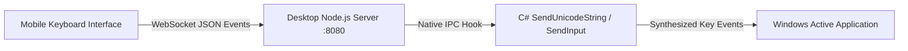

# Advanced PC Keyboard & Media Hub

[← Back to Main Documentation](../README.md)

Nexora provides a full wireless keyboard for Windows with full Unicode text injection, modifier key persistence, media control, and dedicated system hotkeys.

---

## Technical Overview

---

## Key Features

### 1. Unicode & Full Emoji Typing
- Unlike legacy remote mouse apps that simulate hardware virtual keycodes (VK), Nexora integrates native C# `SendUnicodeString` key injection.
- Type any language script (Latin, Cyrillic, Asian scripts, Arabic, Devanagari) as well as rich Unicode emojis (😀, 🔥, ⚡, 🚀, 💻) directly into text fields, code editors, and browsers.

### 2. Media & Audio Center
- **Dedicated Media Controls**: Play/Pause, Next Track, Previous Track, Stop, and Mute.
- **Master Volume**: Instant volume stepping and continuous adjustments directly mapped to Windows master audio endpoints.

### 3. Persistent Modifier Keys
- Tap **Ctrl**, **Alt**, **Shift**, or **Win** to lock modifiers in an active state.
- Combine locked modifiers with single key taps for complex shortcuts (e.g. `Ctrl + Alt + Del`, `Ctrl + Shift + Esc`, `Alt + F4`).

### 4. Windows System Shortcuts

| Shortcut Button | Windows Action |
| :--- | :--- |
| **Win + L** | Instantly lock your Windows PC |
| **Win + R** | Open the Windows Run command box |
| **Win + Shift + S** | Trigger the Windows Snipping Tool screen capture |
| **PrtSc** | Full-screen print screenshot |
| **Ctrl + Shift + Esc** | Launch Windows Task Manager directly |
| **F1 – F12** | Complete function key array |

---

[← Back to Main Documentation](../README.md)
