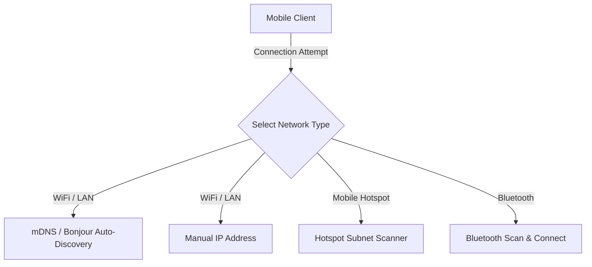

# 🌐 Network Discovery & Connectivity Guide

Nexora supports multiple methods to discover and connect your mobile device and PC, whether you are on a home Wi-Fi network, a mobile hotspot, or using Bluetooth.

---

## 🛠️ Connection Methods

---

## 1. Wi-Fi Connection & mDNS Discovery

When both devices are on the same local Wi-Fi network, discovery is fully automated.

### How mDNS Works:
- The desktop app registers a local service named `_nexora._tcp` on your network using the `bonjour-service` library.
- The mobile app scans for active `_nexora._tcp` Bonjour records.
- When found, it automatically retrieves the PC's hostname, local IP address, and API port, allowing connection without typing any IP address.

---

## 2. Mobile Hotspot Connection

If Wi-Fi is unavailable (e.g. traveling or public network blocks), you can connect by enabling Mobile Hotspot on your PC.

### Subnet Handling
When your phone connects to your PC's hotspot, the phone is assigned an IP inside a specific subnet. Nexora handles these common hotspot IP spaces automatically:
- **Windows Hotspot Subnet**: Typically `192.168.137.x` (PC is host `192.168.137.1`).
- **Android Hotspot Subnet**: Typically `192.168.43.x`.
- **iPhone Hotspot Subnet**: Typically `172.20.10.x`.

The desktop app detects all active network adapters (including virtual adapters created by hotspots) and displays all detected IP addresses. Simply select or input the active adapter IP in the mobile app.

---

## 3. Bluetooth Connectivity (Experimental)

Bluetooth provides an alternative connection channel when local IP networking is blocked or restricted.

### How it works:
- **Desktop Peripheral**: The desktop app sets up a Bluetooth Low Energy (BLE) peripheral using `@abandonware/noble` (or similar node bindings) to advertise its service.
- **Mobile Scanning**: The mobile app scans for BLE peripherals advertising the Nexora Service UUID.
- **Connection**: Once connected, controls are serialized and sent over a Bluetooth GATT Characteristic instead of WebSockets.

*Note: Bluetooth throughput is lower than Wi-Fi. It is recommended primarily for mouse and keyboard control, not for file transfer.*

---

## 🛡️ Firewall & Profile Requirements

Local network connections can be blocked by Windows Security if your network profile is incorrect.

### Network Category Configuration
Windows Firewall blocks inbound connections on **Public** networks by default.
- **WiFi**: Ensure your connection is set to **Private** in Windows Network Settings.
- **Hotspot**: The virtual hotspot interface is frequently set to Public. Run `set-network-private.bat` as an Administrator to change it to Private, which opens the interface for mobile connections.
