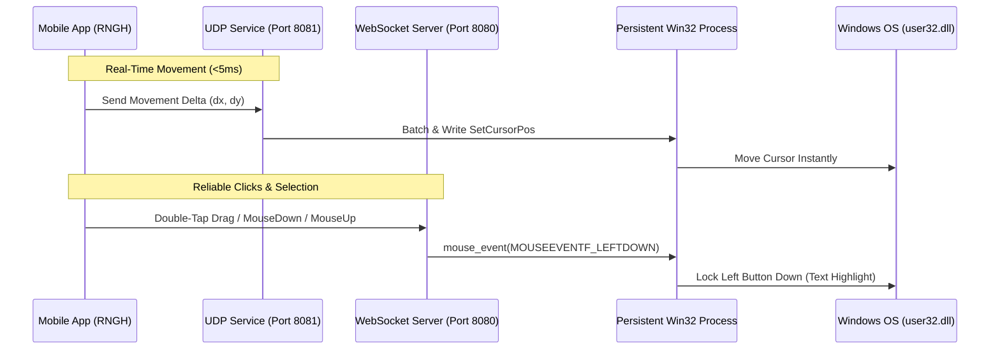

# 🖱️ Touchpad & Mouse Control Feature

The **Touchpad Control** feature turns your mobile device's screen into a precise, ultra-low-latency mouse touchpad. It maps native touch gestures onto PC cursor movements, click events, and fluid text selection with hardware trackpad parity.

---

## 🛠️ How It Works

### 1. Hybrid UDP + WebSocket Architecture
- **UDP (Port 8081)**: Fire-and-forget streaming for real-time cursor movement. Eliminates TCP queuing lag for crisp, <5ms responsiveness.
- **WebSocket (Port 8080)**: Reliable delivery for `mouseDown`, `mouseUp`, single/double/triple clicks, and drag state changes.

### 2. Native Double-Tap-and-Drag Text Selection
- **First Tap**: Touch-down and lift.
- **Second Tap**: Touch-down within **350ms** and hold/move.
- The gesture engine detects the second tap, triggers a subtle haptic vibration, and dispatches `mouseDown('left')`.
- As the finger glides across the touchpad, cursor move deltas are sent while holding Left Click Down on PC — **enabling effortless and natural text selection, word highlighting, code block selection, and window dragging**.
- Releasing your finger dispatches `mouseUp('left')`.

---

## 👆 Supported Gestures & Usage Guide

| Gesture | Action | Trigger Details |
| :--- | :--- | :--- |
| **One-Finger Slide** | Move Cursor | Smooth cursor tracking with configurable acceleration & pointer precision. |
| **Single Tap** | Left Click | Triggers a left-click event at the current cursor position. |
| **Double Tap** | Double Click | Triggers a double-click event (selects word under cursor or opens file). |
| **Double-Tap & Hold + Slide** | **Drag & Text Select** | Simulates holding the left mouse button while moving (highlight text, drag windows, select files). |
| **Long Press (320ms) + Slide** | **Haptic Drag Select** | Hold finger still for 320ms until phone vibrates, then slide to select text. |
| **Two-Finger Tap** | Right Click | Opens contextual menus at the current cursor position. |
| **Three-Finger Tap** | Middle Click | Triggers middle click (open link in background tab / auto-scroll). |
| **Two-Finger Scroll** | Fluid Scroll | Smooth vertical and horizontal page scrolling. |
| **Infinite Scroll Bar** | Fast Page Navigation | Dedicated side scroll bar for rapid document browsing. |

---

## ❓ FAQ & Troubleshooting

### Why is the cursor moving too fast or slow?
- You can adjust the touchpad sensitivity and enable/disable mouse acceleration in the Nexora Mobile App settings.

### Cursor is jumpy or lagging
- Ensure that you are connected to a 5GHz Wi-Fi network, or connect directly to a Windows Mobile Hotspot.
- Disable any active VPNs that route local subnet traffic through remote gateways.
