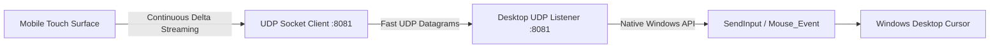

# Smart Trackpad & Cursor Control

[← Back to Main Documentation](../README.md)

Nexora transforms your smartphone into a precision multi-touch trackpad with native drag-selection, fluid momentum scrolling, and sub-5ms input latency over local Wi-Fi.

---

## Technical Architecture

---

## Key Capabilities

### 1. Precision Double-Tap-and-Drag
- **Text & Block Selection**: Double-tap and hold anywhere on the trackpad to immediately activate left-mouse click-and-drag.
- Move your finger across the surface to highlight code snippets, select text in documents, or drag desktop application windows.
- Releasing your finger automatically dispatches the mouse release event.

### 2. Sub-5ms Input Latency via UDP
- Cursor movement deltas are streamed via **UDP datagrams** rather than TCP/WebSocket.
- Fire-and-forget UDP streaming eliminates TCP packet buffering and head-of-line blocking, ensuring instantaneous cursor tracking.

### 3. Multi-Touch Gesture Suite

| Gesture | Action | Description |
| :--- | :--- | :--- |
| **1-Finger Tap** | Left Click | Standard primary click |
| **2-Finger Tap** | Right Click | Opens context menus |
| **3-Finger Tap** | Middle Click | Opens links in new browser tabs / auto-scroll |
| **2-Finger Drag** | Fluid Scroll | Smooth vertical and horizontal document scrolling |
| **Pinch-to-Zoom** | Zoom In / Out | Dispatches Ctrl + Mouse Wheel zoom events |
| **Side Scrollbar** | Fast Infinite Scroll | Rapidly traverse lengthy PDFs, code files, and web pages |

---

## Customizable Trackpad Settings

Configure trackpad behavior from the Mobile Settings tab:
- **Sensitivity & Speed**: Adjust linear cursor speed from 0.5x to 3.0x.
- **Acceleration Curve**: Toggle pointer acceleration for rapid travel across ultra-wide and multi-monitor setups.
- **Scroll Inversion**: Toggle Natural vs Traditional scrolling direction.

---

[← Back to Main Documentation](../README.md)
