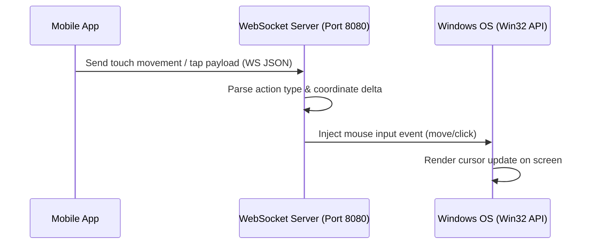

# 🖱️ Touchpad & Mouse Control Feature

The **Touchpad Control** feature turns your mobile device's screen into a precise, responsive mouse touchpad. It maps native touch gestures onto PC cursor movements and click events.

---

## 🛠️ How It Works



### 1. Gesture Tracking (Mobile Client)
The mobile app leverages the native gesture handler (`react-native-gesture-handler`) to track tap coordinates and move deltas.
To prevent lag, movement coordinates are tracked as deltas ($\Delta X$, $\Delta Y$) rather than absolute screen coordinates.

### 2. Communication Protocol
Gestures are serialized and sent over a high-speed local WebSocket connection (`ws://YOUR_PC_IP:8080`):
- **Mouse Move Event Payload**:
  ```json
  { "type": "mouse_move", "dx": 2.5, "dy": -1.2 }
  ```
- **Mouse Click Event Payload**:
  ```json
  { "type": "mouse_click", "button": "left", "double": false }
  ```

### 3. Server-Side Execution (Desktop Host)
The server maps incoming deltas and injects them into the Windows OS.
- In earlier versions, this was done using Node wrappers around OS calls.
- In the current optimized build, mouse coordinates are processed via high-performance system triggers, ensuring there is zero perceptible input lag.

---

## 👆 Supported Gestures & Usage Guide

| Gesture | Action | Trigger Details |
| :--- | :--- | :--- |
| **One-Finger Slide** | Move Cursor | Slides the mouse cursor smoothly across the screen. |
| **Single Tap** | Left Click | Triggers a left-click event at the current cursor position. |
| **Double Tap** | Double Click | Triggers a double-click event (useful for selecting words or launching apps). |
| **Double-Tap & Hold + Slide** | Tap-and-Drag | Simulates holding the left mouse button while moving (e.g., highlighting text, dragging items). |
| **Long Press & Slide** | Drag Selection | Direct click-and-drag simulation without requiring a double-tap. |
| **Two-Finger Tap** | Right Click | Opens contextual menus at the current cursor position. |
| **Three-Finger Tap** | Middle Click | Triggers middle click (frequently used to open links in a new tab). |
| **Two-Finger Scroll (Vertical/Horizontal)** | Scroll Page | Moves the active viewport scrollbars smoothly using dynamic delta calculations. |

---

## ❓ FAQ & Troubleshooting

### Why is the cursor moving too fast or slow?
- You can adjust the touchpad sensitivity settings inside the Nexora Mobile App.

### Cursor is jumpy or lagging
- Ensure that you are connected to a strong 5GHz Wi-Fi network, or set up a Windows Mobile Hotspot. Signal interference on 2.4GHz bands can occasionally queue WebSocket messages, causing cursor jitter.
- Disable any active VPN on either your mobile device or your PC.
